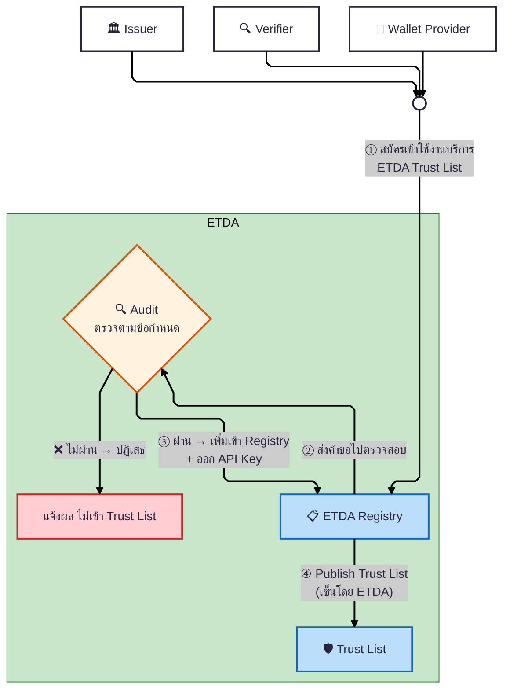
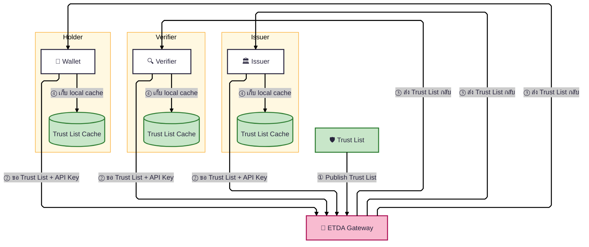

# 1.2 บทบาทผู้เกี่ยวข้อง และ Trust Model

ต่อจาก [1.1 คำศัพท์และนิยาม](01-glossary.md) บทนี้อธิบายว่าใครมีบทบาทอะไรในระบบ และแต่ละฝ่ายเชื่อใจกันได้อย่างไร (Trust Model) ซึ่งเป็นหลักการพื้นฐานที่ทุกบทถัดไปอ้างอิงถึง

## 1.2 บทบาทและผู้เกี่ยวข้อง

| บทบาท | หน้าที่ |
|-------|--------|
| ETDA(Governance Authority, Trust Service Provider) | วางกฎ อนุมัติผู้เข้าร่วม ดูแลบริการกลาง เช่น list, PKI|
| Issuer | สร้างและเซ็น credential |
| Holder | เก็บและแสดง credential |
| Verifier | ตรวจและเชื่อ credential |

## 1.3 Trust Model

Trust Model บอกว่าใครเชื่อใคร และเชื่อเพราะอะไร ในระบบนี้ทุกคนเชื่อจุดเดียวกันคือ ETDA แล้วส่งต่อความเชื่อผ่าน Trustlist

- **Root of trust:** ETDA คือจุดที่ทุกคนเชื่อ เพราะ ETDA เป็นคนดูแล Trustlist ทุกคนในระบบใช้ Trustlist ของ ETDA ตัดสินว่าใครเชื่อถือได้
- **Trust chain:** ETDA Registry publish Trustlist ออกมา แต่ละ entity ดึง Trustlist ผ่าน ETDA Gateway มาเก็บเป็น local cache แล้วใช้เช็คว่า entity อื่นอยู่ใน Trustlist หรือไม่ ความเชื่อจึงส่งต่อจาก ETDA → Trustlist → ผู้เข้าร่วมทุกคน
- **การสร้าง trust:** ผู้เข้าร่วมสมัครเข้ามาที่ ETDA จากนั้น ETDA จะตรวจสอบและอนุมัติให้เข้าไปอยู่ใน Trustlist เมื่ออยู่ใน Trustlist แล้ว คนอื่นจึงเชื่อได้
- **การถอน trust:** ผู้ที่ต้องการเพิกถอน ทำเรื่องมาที่ ETDA จากนั้น ETDA จะตรวจสอบและเพิกถอนออกจาก Trustlist เมื่อออกจาก Trustlist แล้ว คนอื่นจะไม่เชื่ออีกต่อไป
- **การเข้าถึง Trustlist:** ผู้เข้าร่วมดึง Trustlist ผ่าน ETDA API Gateway โดย ETDA จะให้ 1 API key ต่อ 1 Service ของแต่ละ Business

**จุดที่ผู้เข้าร่วมเข้าสู่ระบบ:** ทุก entity (Issuer, Verifier, Wallet Provider) ต้องสมัครและผ่านการตรวจสอบจาก ETDA ก่อนเข้าสู่ระบบ เมื่อผ่านแล้วจึงถูกเพิ่มเข้า Trustlist และได้ API key ไว้ดึง Trustlist มาทำ local cache

#### ภาพ 4a — ETDA Registration & Trust List Publishing

แสดงวิธีที่ entity สมัครเข้าระบบ ผ่านการตรวจสอบ แล้ว ETDA publish Trust List — ไล่ทีละเส้น:

- **เส้นที่ ①:** Issuer / Verifier / Wallet Provider → ยื่นสมัครเข้าใช้งานบริการ ETDA Trust List ที่ ETDA Registry
- **เส้นที่ ②:** ETDA Registry → Audit — ส่งคำขอไปตรวจสอบ entity ตามข้อกำหนด (เอกสาร, ระบบ, ความปลอดภัย)
- **เส้นที่ ③:** Audit ผ่าน → เพิ่ม entity เข้า Registry + ออก API Key ให้ (ไม่ผ่าน → แจ้งผล ปฏิเสธ)
- **เส้นที่ ④:** ETDA Registry → Publish Trust List (รายชื่อ entity ที่อนุมัติแล้ว พร้อมลายเซ็น ETDA)

#### ภาพ 4b — Trust List Distribution (การกระจาย Trust List)

แสดงวิธีที่แต่ละ entity ดึง Trust List ผ่าน ETDA Gateway แล้วเก็บ local cache ไว้ตรวจสอบ

- **เส้นที่ ①:** Trust List → ETDA Gateway — Publish Trust List ให้ ETDA Gateway พร้อมให้บริการ
- **เส้นที่ ②:** Entity → ETDA Gateway — แต่ละ entity ส่ง request ขอ Trust List (แนบ API Key)
- **เส้นที่ ③:** ETDA Gateway → Entity — ETDA Gateway ส่ง Trust List กลับ
- **เส้นที่ ④:** Entity → Cache — entity เก็บ Trust List ไว้ใน local cache เพื่อใช้ตรวจสอบ

**Pull บ่อยแค่ไหน + Audit เมื่อไหร่:**

| การทำงาน | ความถี่ | รายละเอียด |
|----------|---------|-----------|
| **Pull Trust List (ปกติ)** | ตามอายุ cache (TTL — Time-to-Live) — **[ยังไม่ได้กำหนดค่ามาตรฐานอย่างเป็นทางการ — ตัวอย่างที่ปรากฏในบทที่ 3 เช่น "24 ชั่วโมง" เป็นเพียงค่าสมมติสำหรับสาธิต ไม่ใช่ spec จริง; ค่าจริงจะประกาศโดย ETDA ในเวอร์ชันถัดไป]** | entity ดึงผ่าน ETDA Gateway (แนบ API Key) แล้วเก็บ local cache — เมื่อ cache หมดอายุจึงดึงใหม่ |
| **Pull Trust List (เร่งด่วน)** | ทันทีที่ ETDA แจ้งเปลี่ยนแปลง เช่น มี revocation | ดึงใหม่ก่อน cache หมดอายุ เพื่อไม่เชื่อ entity ที่เพิ่งถูกถอน |
| **Pull ตอน cache ใช้ไม่ได้** | ก่อนตัดสินใจ trust ถ้า cache หมดอายุ/เสียหาย | ห้ามใช้ cache ที่หมดอายุตัดสินใจเรื่อง trust |
| **Audit (ขาเข้า)** | ครั้งเดียว ก่อนเข้า Trustlist | ETDA ตรวจสอบ entity ก่อนอนุมัติเข้า Trust List (ภาพ 4a เส้น ② Registry → Audit) |
| **Audit (ระหว่างใช้)** | ตามรอบที่ ETDA กำหนด [ยังไม่ได้กำหนดค่า] | ETDA ตรวจซ้ำว่า entity ยังปฏิบัติตามข้อกำหนด |
| **Revocation** | เมื่อ audit ไม่ผ่าน หรือ entity ขอถอนตัว | ETDA ถอนออกจาก Trust List → รอบ pull ถัดไป ทุก entity จะไม่เชื่อถืออีก |

#### ภาพ 4c — Trust List ใช้ตรวจอะไร (Usage Scenarios)

แสดงว่าแต่ละ entity นำ Trust List ที่ cache ไว้ ไปใช้ตรวจคู่สื่อสารอย่างไร — แบ่งเป็น 2 flow รวม **จุดตรวจที่ 1–6** เรียงตามลำดับเวลา ส่วนผังการตรวจแบบละเอียด (step-by-step พร้อม diagram เต็ม) อยู่ในบทที่อธิบาย flow นั้น ๆ โดยตรง เพื่อไม่ให้ diagram ซ้ำกันหลายที่ — ตารางด้านล่างเป็นดัชนีสรุปจุดตรวจทั้งหมด พร้อมลิงก์ไปดูรายละเอียด:

- **Flow ออก VC (OID4VCI) — จุดตรวจที่ 1–3:** จุดตรวจที่ 1 (Wallet ตรวจ Issuer ก่อนขอบัตร) ดูที่ [3.2.2 Early Trust Check — Issuer](../03-issuance-flow/02-full-flow/03-setup-and-credential-offer.md) (STEP 1.5); จุดตรวจที่ 2–3 (Issuer ตรวจ Wallet Provider, Wallet ตรวจ Issuer ก่อนบันทึก) ดูผังละเอียดที่ [3.2.5 Trustlist Verification](../03-issuance-flow/02-full-flow/06-verification-details.md) (STEP 5.5, 6.5)
- **Flow แสดง VP (OID4VP) — จุดตรวจที่ 4–6:** ดูภาพรวมที่ [4.1.1 SETUP, สแกน QR, ตรวจ Verifier](../04-presentation-flow/01-overview/02-setup-and-request.md) และรายละเอียดทางเทคนิคทุกขั้นตอนที่ [4.2.1 Full Flow เทคนิคโดยละเอียด](../04-presentation-flow/02-full-flow/02b-full-flow-technical-detail.md) (จุดตรวจสอบที่ 1–4 ในเอกสารนั้น ครอบคลุม Verifier / Wallet Provider / Issuer / สถานะเอกสาร)

**สรุป: Trust List ถูกใช้ทุกครั้งที่ entity ต้องตัดสินใจเรื่อง trust**

| จุดตรวจที่ | Flow | Step ใน flow เต็ม | ใครเช็ค | เช็คอะไร | ถ้าไม่ผ่าน |
|:---------:|------|:-----------------:|---------|---------|-----------|
| **1** | ออก VC | 3.1 (§ 3) | Wallet | Issuer ใน Credential Offer อยู่ใน Trust List? | หยุด ไม่ส่ง Transaction Code |
| **2** | ออก VC | 5.5 (§ 3) | Issuer | Wallet Provider อยู่ใน Trust List? | ไม่ออก VC |
| **3** | ออก VC | 6.5 (§ 3) | Wallet | Issuer อยู่ใน Trust List? | ทิ้ง VC ไม่บันทึก |
| **4** | แสดง VP | 2.6 (§ 4) | Wallet | Verifier อยู่ใน Trust List? | ไม่ส่งข้อมูลให้ (จุดที่สำคัญที่สุดฝั่ง Wallet) |
| **5** | แสดง VP | 4.1 (§ 4) | Verifier | Wallet Provider อยู่ใน Trust List? (บังคับเฉพาะ Wallet ของรัฐ) | ปฏิเสธ |
| **6** | แสดง VP | 4.2 (§ 4) | Verifier | Issuer ของ VC อยู่ใน Trust List + status + สิทธิ์ออกบัตร? | ไม่เชื่อถือข้อมูล |

> **หมายเหตุ:** หลักการตรวจสอบพื้นฐาน 4 ขั้น (Core Security Rules) ที่ทุก flow ใช้ร่วมกัน อยู่ที่หัวข้อ "หลักการตรวจสอบร่วม (Common Verification Pattern)" ในบท [1.4 หลักการตรวจสอบ — ใครตรวจใคร](./03-common-verification-pattern.md)

จบเนื้อหาบทที่ 1 (คำศัพท์และบทบาท) — บทถัดไปคือ [บทที่ 2 สถาปัตยกรรม](../02-architecture/01-overview.md) อธิบายว่าส่วนประกอบต่าง ๆ (Gateway, Trustlist, Resolver) เชื่อมต่อกันอย่างไรในทางเทคนิค

