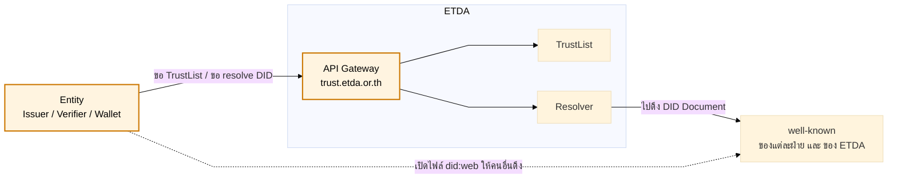
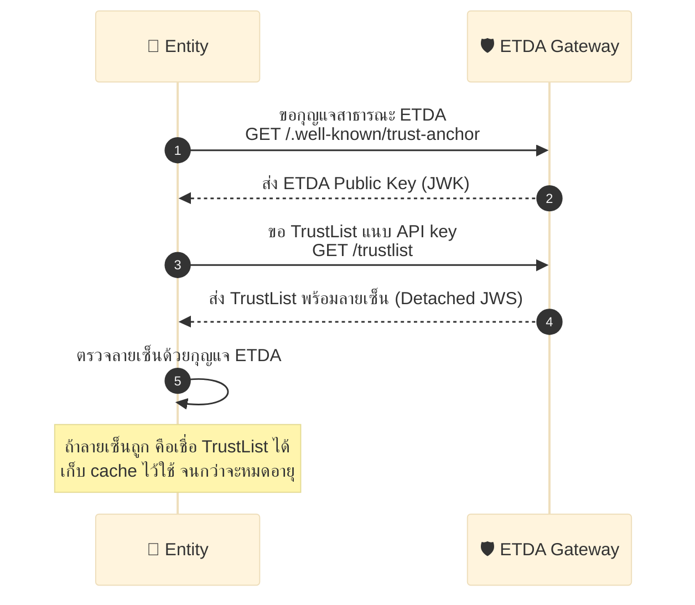
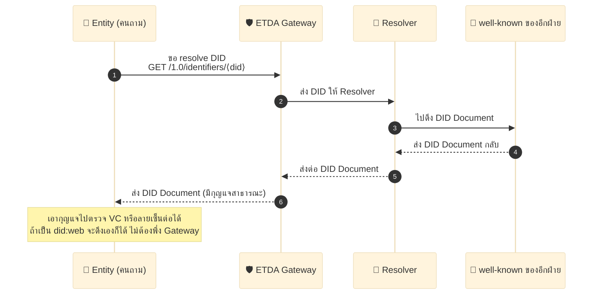

# 2.1 สถาปัตยกรรม (Architecture) — ภาพรวม

ต่อจากบทที่ 1 ([คำศัพท์และบทบาท](../01-concepts-and-roles/01-glossary.md)) ที่อธิบายว่าใครเป็นใครและเชื่อกันอย่างไร บทนี้ลงรายละเอียดทางเทคนิคว่าส่วนประกอบต่าง ๆ ของระบบ (Gateway, Trustlist, Resolver) เชื่อมต่อกันอย่างไร

## 2.1 บทนำและขอบเขต

- **จุดประสงค์:** วางกรอบความเชื่อถือสำหรับการทำ VC เพื่อป้องกันไม่ให้ผู้ไม่น่าเชื่อถือเข้ามาในระบบ VC ของประเทศไทย
- **ขอบเขต:** ครอบคลุมกฎที่ Entity ทุกฝ่ายต้องปฏิบัติตาม เพื่อเข้าร่วมกรอบความน่าเชื่อถือและดูแลความปลอดภัยทางเทคโนโลยี ไม่ครอบคลุมวิธีใช้งานหรือกฎหมายที่เกี่ยวข้อง
- **ใครต้องทำตาม:** Issuer, Wallet, Verifier, ETDA
- **คำบังคับ:** ใช้ MUST / SHOULD / MAY (RFC 2119)

## 2.2 สถาปัตยกรรม (Architecture)

ส่วนนี้เล่าว่าระบบมีอะไรบ้าง และแต่ละส่วนคุยกันยังไง แบบเข้าใจง่าย

### ภาพรวมของระบบ

ในระบบนี้มีของหลัก ๆ ไม่กี่อย่าง:

- **Entity** = ผู้เข้าร่วม เช่น Issuer, Verifier, Wallet (คนที่มาขอใช้บริการ)
- **API Gateway** = ประตูทางเข้าของ ETDA ทุกคนต้องคุยผ่านประตูนี้ (`trust.etda.or.th`)
- **TrustList** = บัญชีรายชื่อคนที่เชื่อถือได้ โดย ETDA เป็นคนเซ็นรับรอง
- **Resolver** = ตัวช่วยไปตามหาข้อมูล DID ให้
- **well-known** = ไฟล์สาธารณะที่แต่ละฝ่ายเปิดไว้ ข้างในมีกุญแจสาธารณะ (public key)

รูปข้างล่างเป็นภาพรวม กล่องสีคือส่วนที่คนใช้งานคุยด้วยบ่อยที่สุด (Entity กับ Gateway) ส่วนที่เหลือเป็นของหลังบ้านของ ETDA

ระบบทำงานหลัก ๆ อยู่ 2 เรื่อง ถ้าดูรูปบนแล้วยังงง ให้ดูทีละเรื่องข้างล่างนี้

### 2.2.1 ขอ TrustList แล้วตรวจว่าจริงไหม

Entity ขอรายชื่อที่เชื่อถือได้ (TrustList) ผ่าน Gateway จากนั้นเอากุญแจสาธารณะของ ETDA มาตรวจลายเซ็น ถ้าลายเซ็นถูก แปลว่ารายชื่อนี้ของจริง เชื่อได้

ไล่ทีละขั้น:

1. ขอกุญแจสาธารณะของ ETDA ก่อน (จากไฟล์ trust-anchor)
2. ขอ TrustList โดยแนบ API key
3. Gateway ส่ง TrustList พร้อมลายเซ็น (Detached JWS) กลับมา
4. Entity ตรวจลายเซ็นด้วยกุญแจของ ETDA
5. ถ้าถูก เก็บ TrustList ไว้ใช้ (cache) พร้อมจำวันหมดอายุ

### 2.2.2 ขอ Resolver ช่วยหา DID

บางที Entity มีแค่ชื่อ DID ของอีกฝ่าย แต่ยังไม่มีกุญแจ จึงขอให้ Gateway ช่วยไปตามหา DID Document (ที่มีกุญแจสาธารณะอยู่ข้างใน) ให้

ไล่ทีละขั้น:

1. Entity ส่งชื่อ DID ไปที่ Gateway (เช่น `did:ndid:...`)
2. Gateway ส่งต่อให้ Resolver
3. Resolver ไปดึง DID Document จากไฟล์ well-known ของฝ่ายนั้น
4. ส่ง DID Document กลับมาที่ Entity
5. Entity เอากุญแจใน DID Document ไปตรวจ VC หรือลายเซ็นต่อ

### 2.2.3 ถ้าอยากใช้ DID แบบพิเศษ (Custom DID)

ปกติ Resolver ส่วนกลางของ ETDA รู้จัก DID แบบมาตรฐานอยู่แล้ว แต่บาง Entity อยากใช้ DID แบบของตัวเอง (เรียกว่า **Custom DID Method**) ที่ Resolver กลางยังไม่รู้จัก

แบบนี้ก็ทำได้ แต่ต้องคุยกับ ETDA ก่อน แล้วเลือกวิธีเชื่อมต่อ 1 ใน 2 แบบ:

- **แบบที่ 1:** Entity ส่ง "ตัวช่วยอ่าน DID" (DID Driver) ให้ ETDA เอาไปติดตั้งใน Resolver กลาง แล้ว Resolver กลางก็อ่าน Custom DID ได้เอง
- **แบบที่ 2:** Entity เปิด Resolver ของตัวเอง แล้วให้ Gateway ของ ETDA ยิงคำขอเข้ามา (Entity ต้องอนุญาต IP ของ Gateway ก่อน หรือที่เรียกว่า Whitelist)

รายละเอียดครบ ๆ ทั้งขั้นตอนการลงทะเบียนและรูปประกอบ ดูได้ที่ [§ 6.1.1.1 การใช้งาน Custom DID](../06-security-and-privacy/01-verifier-confidence-and-registration.md#6111-การใช้งาน-custom-did)

**สรุปส่วนประกอบและเส้นทางข้อมูล:**

- **ส่วนประกอบ:** Gateway, TrustList, Resolver, Entity, well-known (DID)
- **เส้นทางข้อมูล:** Entity ⇄ Gateway ⇄ TrustList และ Entity ⇄ Gateway ⇄ Resolver ⇄ well-known

---

จบเนื้อหาบทที่ 2 (สถาปัตยกรรม) — บทถัดไปคือ [บทที่ 3 กระบวนการออกเอกสาร (OID4VCI)](../03-issuance-flow/01-minimal-flow.md) อธิบาย flow การออก VC แบบเต็มทุกขั้นตอน เริ่มจาก Minimal Flow ที่เข้าใจง่ายก่อน

