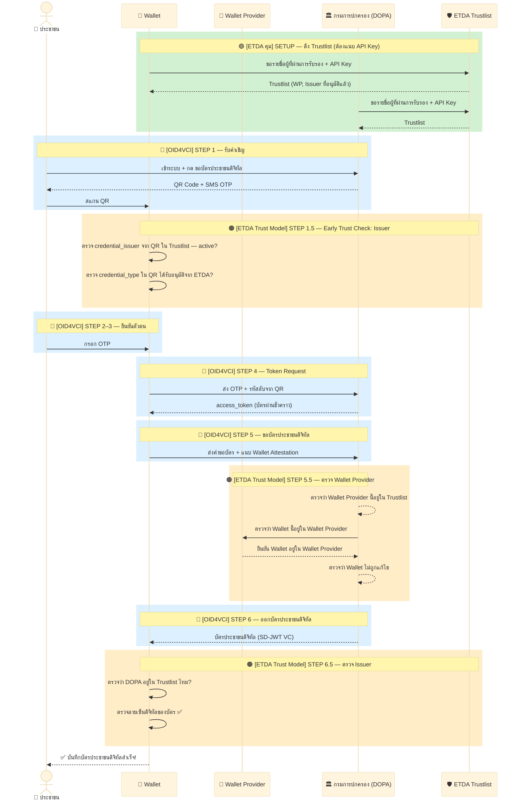
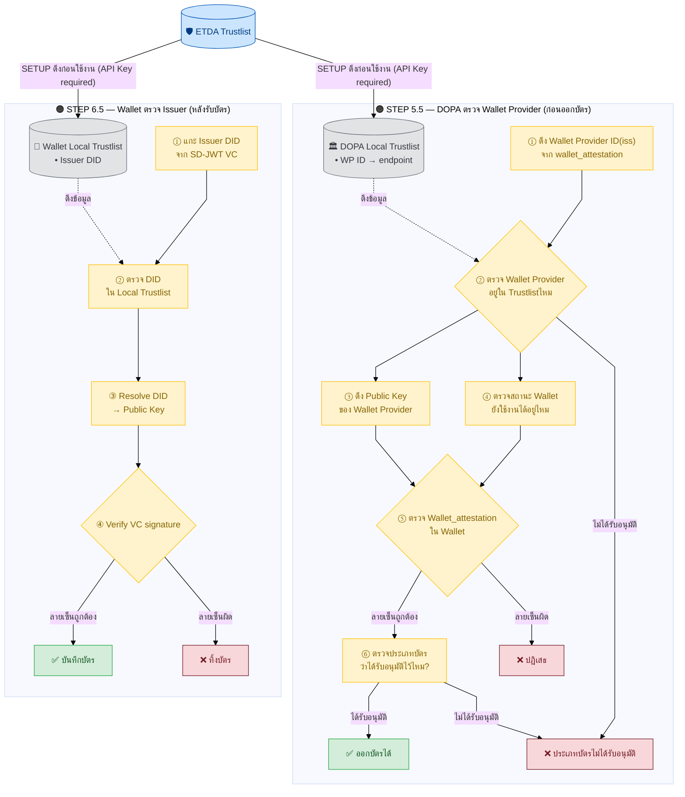

# 3.1 กระบวนการออกเอกสาร (OID4VCI) — ภาพรวมและ Minimal Flow

บทนี้อธิบายกระบวนการออกเอกสาร (Verifiable Credential) ตามมาตรฐาน OID4VCI ตั้งแต่ **Minimal Flow** ที่เข้าใจง่าย (§ 3.1) ไปจนถึง **Full Flow** ฉบับเทคนิคเต็มรูปแบบ (§ 3.2) โดยใช้สถานการณ์ตัวอย่างเดียวกันตลอดทั้งบท

> **Protocol:** OID4VCI **1.0 Final** (openid-4-verifiable-credential-issuance-1_0)
> **VC Format:** IETF SD-JWT VC (dc+sd-jwt) + VC-JOSE-COSE (`typ: dc+sd-jwt`)
> **Status:** IETF Token Status List (`statuslist+jwt`)
> **Flow:** Pre-Authorized Code Flow (สำหรับ VC ทุกประเภท — ไม่ใช้ Authorization Code Flow)
> **Token Binding:** DPoP (RFC 9449) — บังคับสำหรับ **LoA ≥ 3**, แนะนำสำหรับ LoA 2 (ดู [§ 3.2.6.1](02-full-flow/07-data-flow-and-policy.md#32611-loa-แต่ละระดับหมายถึงอะไร))

**สถานการณ์:** ประชาชนขอรับ **บัตรประชาชนดิจิทัล** จากกรมการปกครอง (DOPA) เก็บไว้ในแอป Wallet บนมือถือ

> **หมายเหตุ:** ในตัวอย่างนี้ กรมการปกครอง (DOPA) ทำหน้าที่เป็นทั้ง Credential Issuer และ Authorization Server ในตัวเดียวกัน จึงไม่มีขั้นตอน AS Discovery แยกต่างหาก (Issuer ที่แยก Authorization Server ออกจาก Credential Issuer จะมีขั้นตอน AS Discovery เพิ่มเติมตามมาตรฐาน OID4VCI ซึ่งเอกสารฉบับนี้ยังไม่ครอบคลุมรายละเอียด)

---

## 3.1 Minimal Flow — ภาพรวมและจุดที่ Trust Model คุม

**สีกรอบในผังหมายถึงอะไร:**

| สี | หมายถึง | ใครกำหนด |
|----|---------|----------|
| 🟢 สีเขียว | ขั้นตอนที่ ETDA ดูแลโดยตรง (Trustlist) | ETDA |
| 🔵 สีน้ำเงิน | ขั้นตอนตามมาตรฐาน OID4VCI สากล | OpenID Foundation |
| 🟠 สีส้ม | จุดตรวจสอบ trust ว่าใครน่าเชื่อถือ | Trust Framework (ETDA) |
| ⚪ สีเทา | ขั้นตอนเตรียมการของ Wallet Provider | Wallet Provider |

**Trustlist Verification — จุดตรวจที่ ETDA คุม (2 จุดใน flow):**

---

### 3.1.1 คำอธิบายแต่ละขั้นตอน (สำหรับผู้อ่านทั่วไป)

**ภาพรวม:** เปรียบได้กับการไปทำบัตรประชาชนที่อำเภอ แต่ทำทั้งหมดผ่านมือถือ โดยมี ETDA รับประกันว่าทุกคนในระบบ (กรมการปกครอง, แอป Wallet) ผ่านการตรวจสอบมาแล้ว

**🟢 ก่อนเริ่ม — SETUP (ETDA คุม)**

Wallet และ DOPA ดึง ETDA Public Key จาก `/.well-known/trust-anchor` แล้วดึง Trustlist (พร้อม API Key) มาเก็บไว้ใน Local Storage ใช้สำหรับ verify ทุกขั้นตอนที่ต้องตรวจ trust

**🔵 STEP 1 — รับคำเชิญ (OID4VCI)**

เราเข้าเว็บไซต์บริการประชาชนของกรมการปกครอง แล้วกดขอบัตรประชาชนดิจิทัล ระบบจะแสดง QR Code บนหน้าจอ และส่ง OTP มาทาง SMS เราเปิดแอป Wallet สแกน QR Code นั้น แค่นี้แอปก็รู้แล้วว่าจะไปขอบัตรจากที่ไหน

**🔵 STEP 2 — ดูข้อมูลผู้ออกบัตร (OID4VCI)**

แอป Wallet ดึงข้อมูลเบื้องต้นจากกรมการปกครองมาก่อน เช่น บัตรแบบไหนออกได้ ใช้รูปแบบข้อมูลอะไร และต้องส่งคำขอไปที่ endpoint ไหน เปรียบเหมือนอ่านป้ายประกาศหน้าเคาน์เตอร์ก่อนกรอกแบบฟอร์ม

**[7.1] Scope Validation** — แอปตรวจว่า `credential_configurations_supported` มีประเภทบัตรที่ต้องการหรือไม่ ถ้าไม่พบ → หยุดทันที ไม่ส่งคำขอต่อ

**🔵 STEP 3 — ยืนยันตัวตนด้วย OTP (OID4VCI)**

แอปถามว่า "กรุณากรอก OTP ที่ได้รับทาง SMS" เราพิมพ์รหัส OTP เข้าไป นี่คือการยืนยันว่าเราเป็นเจ้าของเบอร์โทรนั้นจริง

**🔵 STEP 4 — แลกบัตรผ่านชั่วคราว (OID4VCI)**

แอปนำ OTP และรหัสลับจาก QR ไปยื่นให้กรมการปกครอง แล้วได้ "access_token" กลับมา เปรียบเหมือนบัตรคิวที่ใช้ได้แค่ 5 นาที สำหรับขั้นตอนถัดไป

**🔵 STEP 5 — ขอรับบัตรประชาชนดิจิทัล (OID4VCI)**

แอปสร้าง key คู่ (กุญแจส่วนตัว + กุญแจสาธารณะ) บนมือถือของเรา แล้วส่งคำขอบัตรพร้อมแนบ "Wallet Attestation" (หลักฐานว่าแอปนี้ผ่านการรับรองแล้ว) ไปให้กรมการปกครอง

**🟠 STEP 5.5 — กรมการปกครองตรวจ Wallet Provider (ETDA Trust Model)**

DOPA ตรวจ 6 ขั้นตอน: (1) แกะ WP ID จาก `wallet_attestation` → (2) หา WP endpoint จาก Trustlist → (3) ดึง WP Public Key และสถานะ Wallet → (4) ตรวจลายเซ็น WA → (5) ตรวจ aal → (6) ตรวจประเภทบัตรด้วยตัวเอง

ถ้าขั้นตอนใดล้มเหลว → ปฏิเสธทันที ไม่ออกบัตร

**🔵 STEP 6 — ออกบัตรประชาชนดิจิทัล (OID4VCI + IETF SD-JWT VC (dc+sd-jwt))**

กรมการปกครองสร้าง SD-JWT VC ตามมาตรฐาน IETF SD-JWT VC (dc+sd-jwt) มีโครงสร้าง 3 ชั้น:

- **JOSE Header:** `typ: dc+sd-jwt`, `alg: ES256`, `kid: https://issuer.dopa.go.th#key-2025-1`
- **JWT Claims:** `iss`, `sub`, `jti`, `nbf`, `exp`, `cnf.jwk`, `_sd_alg: sha-256`, `status.status_list` (IETF Token Status List)
- **VC Body (IETF SD-JWT VC (dc+sd-jwt)):** `@context`, `type: [VerifiableCredential, ThaiNationalIDCredential]`, `issuer: {id, name}`, `validFrom`, `validUntil`, `credentialSubject: {id, ชื่อ, เลขบัตร, วันเกิด}`, `credentialSchema`, `_sd: [...]`

**🟠 STEP 6.5 — Wallet ตรวจ Issuer + VC (IETF SD-JWT VC (dc+sd-jwt))**

เมื่อได้รับบัตร Wallet ตรวจ 3 กลุ่มก่อนบันทึก:
1. **ตัวตนผู้ออกบัตร** — เช็คว่าผู้ออกบัตรอยู่ใน Trustlist หรือไม่
2. **ลายเซ็น + อายุ** — เช็คว่าลายเซ็นบนบัตรถูกต้องและยังไม่หมดอายุ
3. **สถานะบัตร** — เช็คกับ statuslist ว่าบัตรยังไม่ถูกยกเลิก

ถ้าขั้นใดไม่ผ่าน → Wallet จะทิ้งบัตรและไม่บันทึกลงในแอป

**🔵 STEP 7 — แจ้งว่ารับบัตรแล้ว (OID4VCI, Optional)**

แอปแจ้งกลับไปยังกรมการปกครองว่าได้รับบัตรเรียบร้อยแล้ว เป็นขั้นตอนเสริมเพื่อให้ระบบของกรมการปกครองรู้ว่าออกบัตรสำเร็จ

---

