# 3.2.1 Full Flow เทคนิคโดยละเอียด — OID4VCI (การออก VC)

## ภาพรวมขั้นตอนทั้งหมด (STEP 1–7)

บทที่ [3.1 Minimal Flow](../01-minimal-flow.md) แสดงภาพรวมแบบง่ายของการออก VC ผ่าน OID4VCI พร้อมจุดที่ Trust Model (ETDA) เข้าควบคุม หน้านี้ (3.2) จะขยายภาพให้เห็น **ทุก STEP ตั้งแต่ SETUP จนถึง STEP 7 (Notification)** อย่างละเอียดขึ้น รวมผู้เกี่ยวข้องทั้งหมด (ประชาชน, Wallet, Wallet Provider, ETDA Trustlist, DOPA, DOPA Status List) และกรณีพิเศษที่ Minimal Flow ยังไม่ครอบคลุม เช่น:

- **DPoP (Demonstrating Proof of Possession)** สำหรับระดับความเชื่อมั่น LoA 3 ขึ้นไป — ผูก access_token กับกุญแจบนเครื่อง ป้องกันการขโมย token ไปใช้งานที่อื่น
- **Immediate vs. Deferred Issuance** — กรณีบัตรออกได้ทันที เทียบกับกรณีที่ต้องรอ (`transaction_id`) แล้วค่อยมาขอรับภายหลัง
- **Trustlist Freshness Check** — จุดตรวจ TTL ของ Trustlist ก่อนแต่ละจุดตรวจ trust (ก่อน STEP 5.5 และก่อน STEP 6.5)
- **โครงสร้าง SD-JWT VC แบบ 3 ชั้น** (JOSE Header / JWT Claims / VC Body ตาม IETF SD-JWT VC `dc+sd-jwt`)

ลำดับขั้นตอนทั้งหมดของ flow นี้ ประกอบด้วย:

| ช่วง STEP | ชื่อขั้นตอน | รายละเอียดเพิ่มเติม |
|-----------|-------------|----------------------|
| SETUP | ดึง ETDA Public Key + Trustlist, Wallet Attestation | [3.2.2](03-setup-and-credential-offer.md) |
| STEP 1–3 | Credential Offer, Early Trust Check, Discovery, Authentication | [3.2.2](03-setup-and-credential-offer.md) |
| STEP 4–5.5 | Token Request, Credential Request, Trust Check: Wallet Provider | [3.2.3](04-token-and-credential-request.md) |
| STEP 6–7 | Issue VC, Trust Check: Issuer, Notification | [3.2.4](05-issue-and-notify.md) |
| — | รายละเอียดการตรวจสอบ Trustlist ทุกจุด (L1–L7) | [3.2.5](06-verification-details.md) |
| — | Data Flow และ LoA/DPoP Policy | [3.2.6](07-data-flow-and-policy.md) |

## รายละเอียดทางเทคนิคระดับ field-by-field

> เนื้อหาส่วนนี้เป็นรายละเอียดทางเทคนิคระดับ field-by-field ของขั้นตอนการออก VC (OID4VCI) ทั้งหมด ครบทุก STEP ตั้งแต่ SETUP จนถึง Notification รวมถึง DPoP (LoA 3+), Deferred Issuance และจุดตรวจสอบ Trust ทุกจุด เหมาะสำหรับผู้พัฒนาและสถาปนิกระบบที่ต้องการรายละเอียดครบทุกขั้นตอน
>
> คลิกที่หัวข้อด้านล่างเพื่อดูเนื้อหาแบบเต็ม (ซ่อนไว้โดยดีฟอลต์เพื่อไม่ให้หน้าเอกสารยาวเกินไป)

<strong>📖 คลิกเพื่อดู Full Flow เทคนิคทั้งหมด (Sequence Diagram + คำอธิบายทุกขั้นตอน)</strong>

## Sequence Diagram ฉบับเต็ม

```mermaid
%%{init: {"theme":"base","themeVariables":{"fontSize":"15px"},"flowchart":{"useMaxWidth":true,"htmlLabels":true,"curve":"linear"}}}%%
sequenceDiagram
    actor EU as 👤 ประชาชน
    participant W as 📱 Wallet
    participant WP as 🏢 Wallet Provider
    participant ETDA as 🛡️ ETDA Trustlist
    participant DOPA as 🏛️ กรมการปกครอง (DOPA)
    participant SL as 📋 DOPA Status List

    rect rgb(210, 240, 210)
        note over W,DOPA: 🟢 [ETDA คุม] SETUP — ดึง ETDA Public Key + Trustlist
        W->>ETDA: GET https://trust.etda.or.th/.well-known/trust-anchor
        ETDA-->>W: ETDA Public Key (JWK)
        W->>W: เก็บ ETDA Public Key ไว้ใน Local Storage
        DOPA->>ETDA: GET https://trust.etda.or.th/.well-known/trust-anchor
        ETDA-->>DOPA: ETDA Public Key (JWK)
        DOPA->>DOPA: เก็บ ETDA Public Key ไว้ใน Local Storage
        W->>ETDA: GET /trustlist + Authorization: Bearer ***
        ETDA-->>W: Trustlist JSON + Detached JWS Signature
        W->>W: Verify Detached JWS ด้วย ETDA Public Key
        W->>W: เก็บ Trustlist + บันทึก TTL (exp claim)
        DOPA->>ETDA: GET /trustlist + Authorization: Bearer ***
        ETDA-->>DOPA: Trustlist JSON + Detached JWS Signature
        DOPA->>DOPA: Verify Detached JWS ด้วย ETDA Public Key
        DOPA->>DOPA: เก็บ Trustlist + บันทึก TTL (exp claim)
    end

    rect rgb(240, 240, 240)
        note over W,WP: ⚙️ [Wallet Provider ดูแล] SETUP — Wallet Attestation
        WP->>WP: ลงทะเบียน Wallet instance + เก็บข้อมูลไว้ใน Registry
        WP-->>W: Wallet Attestation JWT (ลงนามโดย Wallet Provider)
        W->>W: เก็บ Wallet Attestation ไว้ใน Local Storage
    end

    rect rgb(220, 240, 255)
        note over EU,DOPA: 🔵 [OID4VCI] STEP 1 — Credential Offer "รับคำเชิญ"
        EU->>DOPA: [1] เข้าสู่ระบบบริการประชาชน + กด "ขอบัตรประชาชนดิจิทัล"
        DOPA->>DOPA: [2] สร้าง pre_authorized_code + tx_code (OTP)
        DOPA-->>EU: [3] QR Code บนหน้าจอ
        DOPA-->>EU: [4] SMS OTP 512847
        EU->>W: [5] สแกน QR Code
    end

    rect rgb(255, 237, 200)
        note over W,ETDA: 🟠 [ETDA Trust Model] STEP 1.5 — Early Trust Check: Issuer
        W->>W: [5.5] ตรวจ credential_issuer จาก QR ใน Local Trustlist
        W->>W: [5.6] ตรวจ status = active + valid_from ≤ now ≤ valid_until
        W->>W: [5.7] ตรวจ credential_configuration_id ∈ TL.allowed_credential_types
    end

    rect rgb(220, 240, 255)
        note over W,DOPA: 🔵 [OID4VCI] STEP 2 — Discovery "ดูข้อมูลผู้ออกบัตร"
        W->>DOPA: [6] GET /.well-known/openid-credential-issuer
        DOPA-->>W: [7] Credential Issuer Metadata (format, claims, token_endpoint)
        W->>W: [7.1] Scope Validation — ตรวจ credential_configurations_supported ว่ามีประเภทบัตรที่ต้องการ ถ้าไม่พบ → หยุด
    end

    rect rgb(220, 240, 255)
        note over EU,W: 🔵 [OID4VCI] STEP 3 — Authentication "ยืนยันตัวตนด้วย OTP"
        W->>EU: [8] กรุณากรอกรหัส OTP ที่ได้รับทาง SMS
        EU->>W: [9] กรอก OTP: 512847
    end

    rect rgb(235, 230, 255)
        note over W,DOPA: 🔐 DPoP PRE-STEP 4 — สร้าง DPoP Key Pair (LoA 3+)
        W->>W: [9.1] สร้าง DPoP key pair + เก็บ private key ใน Trusted Execution Environment (TEE)
        W->>W: สร้าง DPoP Proof JWT สำหรับ /token — type=dpop, method=POST, jti=unique
    end

    rect rgb(220, 240, 255)
        note over W,DOPA: 🔵 [OID4VCI] STEP 4 — Token Request "แลกบัตรผ่าน"
        W->>DOPA: [10] POST /token + pre_authorized_code + tx_code + DPoP-Proof header (LoA 3+)
        DOPA->>DOPA: [11] Validate: pre_auth_code, OTP, single-use, DPoP Proof signature (LoA 3+)
        DOPA->>DOPA: ผูก access_token กับ DPoP public key
        DOPA-->>W: [12] access_token (DPoP-bound) + c_nonce (expires_in: 300s)
    end

    rect rgb(220, 240, 255)
        note over W,DOPA: 🔵 [OID4VCI] STEP 5 — Credential Request "ขอรับบัตรประชาชนดิจิทัล"
        W->>W: [13] สร้าง Key Pair + ลงนาม JWT Proof ด้วย Private Key + c_nonce
        W->>W: [13.1] สร้าง DPoP Proof ใหม่สำหรับ /credential — htm:POST, jti:new-unique (LoA 3+)
        W->>DOPA: [14] POST /credential + Authorization: DPoP *** DPoP-Proof + credential_configuration_id + proof.jwt + wallet_attestation
    end

    rect rgb(245, 245, 220)
        note over DOPA,WP: ⚙️ Trustlist Freshness Check (ก่อน STEP 5.5)
        alt Trustlist ยังไม่หมดอายุ (now < exp)
            DOPA->>DOPA: ใช้ Local Trustlist เดิม
        else Trustlist หมดอายุ
            DOPA->>ETDA: GET /trustlist + Authorization: Bearer ***
            ETDA-->>DOPA: Trustlist JSON + Detached JWS Signature
            DOPA->>DOPA: Verify + Update Local Trustlist + reset TTL
        end
    end

    rect rgb(255, 237, 200)
        note over DOPA,WP: 🟠 [ETDA Trust Model] STEP 5.5 — Trust Check: Wallet Provider
        DOPA->>DOPA: [15] แกะ wallet_attestation ได้ Wallet Provider ID
        DOPA->>DOPA: [16] ค้นหา WP ใน Local Trustlist ได้ WP endpoint
        DOPA->>WP: [17] GET WP_endpoint/.well-known/provider-info
        WP-->>DOPA: [18] Wallet Provider Public Key
        DOPA->>WP: [19] GET /wallet-registry?wallet_id=...
        WP-->>DOPA: [20] Wallet info + status (registered, valid)
        DOPA->>DOPA: [21] Verify wallet_attestation signature ด้วย WP Public Key
        DOPA->>DOPA: [21.1] Self-check — ตรวจ credential_configuration_id ที่ขอมาอยู่ใน allowed_credential_types ของ DOPA ไหม
    end

    rect rgb(220, 240, 255)
        note over W,DOPA: 🔵 [OID4VCI] STEP 6 — Issue VC "ออกบัตรประชาชนดิจิทัล"
        DOPA->>DOPA: [22] Validate Token + Key Proof + สร้าง SD-JWT VC
        note over DOPA: JOSE — typ:dc+sd-jwt, alg:ES256, kid:issuer.dopa.go.th#key-2025-1
        note over DOPA: JWT — iss, sub, jti, nbf, exp, cnf.jwk, _sd_alg:sha-256, status.status_list
        note over DOPA: VC body — context, type, issuer, validFrom, validUntil, credentialSubject, credentialSchema, _sd
        alt Immediate Issuance
            DOPA-->>W: [23] credential: SD-JWT VC (บัตรประชาชนดิจิทัล)
        else Deferred Issuance
            DOPA-->>W: [23] transaction_id: txn-dopa-456
            W->>DOPA: [24] POST /deferred_credential + transaction_id
            DOPA-->>W: [25] credential: SD-JWT VC (บัตรประชาชนดิจิทัล)
        end
    end

    rect rgb(245, 245, 220)
        note over W,DOPA: ⚙️ Trustlist Freshness Check (ก่อน STEP 6.5)
        alt Trustlist ยังไม่หมดอายุ (now < exp)
            W->>W: ใช้ Local Trustlist เดิม
        else Trustlist หมดอายุ
            W->>ETDA: GET /trustlist + Authorization: Bearer ***
            ETDA-->>W: Trustlist JSON + Detached JWS Signature
            W->>W: Verify + Update Local Trustlist + reset TTL
        end
    end

    rect rgb(255, 237, 200)
        note over W,DOPA: 🟠 [ETDA Trust Model] STEP 6.5 — Trust Check: Issuer
        W->>W: [26] แกะ iss, jti, sub จาก JWT payload
        W->>W: [27] Lookup iss ใน Local Trustlist → พบ status = active
        W->>W: [27.1] ตรวจ iss == issuer.id และ jti == id
        W->>W: [27.2] ตรวจ context มี https://www.w3.org/ns/credentials/v2
        W->>W: [27.3] ตรวจ type มี VerifiableCredential และ type ที่ 2 อยู่ใน allowed_credential_types
    end

    rect rgb(220, 240, 255)
        note over W,DOPA: 🔵 [W3C VC-JOSE-COSE] Resolve Issuer Public Key ผ่าน JWKS
        W->>DOPA: [28] GET https://issuer.dopa.go.th/.well-known/jwt-vc-issuer
        DOPA-->>W: [29] JWKS — รายการ key พร้อม kid, alg, x, y
        W->>W: [29.1] kid matching: หา key ใน JWKS ที่ตรงกับ JOSE header, ดึง publicKeyJwk
    end

    rect rgb(255, 237, 200)
        note over W,DOPA: 🟠 [ETDA Trust Model] STEP 6.5 ต่อ — Verify + Validity + IETF Status
        W->>W: [30] Verify SD-JWT signature ด้วย publicKeyJwk (kid matched)
        W->>W: [30.1] ตรวจ nbf ตรงกับ validFrom (Unix vs ISO 8601) และ sub ตรงกับ credentialSubject.id
        W->>W: [30.2] ตรวจ validFrom น้อยกว่าเท่ากับ now น้อยกว่าเท่ากับ validUntil
        W->>SL: [30.3] GET status.status_list.uri (Accept: application/statuslist+jwt)
        SL-->>W: [30.4] statuslist+jwt
        W->>W: [30.5] Verify statuslist+jwt: iss, typ=statuslist+jwt, sub ตรงกับ uri
        W->>W: [30.6] ตรวจ iat น้อยกว่าเท่ากับ now น้อยกว่าเท่ากับ exp ของ statuslist+jwt
        W->>W: [30.7] Decode lst: base64url แล้ว zlib แล้วดึง bit ที่ index = 0 (valid)
    end

    rect rgb(220, 240, 255)
        note over W,DOPA: 🔵 [OID4VCI] STEP 7 — Notification "แจ้งว่ารับแล้ว" (Optional)
        W->>DOPA: [31] POST /notification credential_id + event=credential_accepted
        DOPA-->>W: [32] 204 No Content
        W-->>EU: [33] บันทึกบัตรประชาชนดิจิทัลสำเร็จ
    end
```

## คำอธิบายทุกขั้นตอน (ทุก step ≤ 2 บรรทัด)

**🟢 SETUP — ดึง ETDA Public Key**
GET `/.well-known/trust-anchor` ได้ ETDA Public Key ทั้ง Wallet และ DOPA เก็บไว้ใช้ verify ลายเซ็น
เป็นจุดเริ่มของ trust chain ทั้งหมด — ETDA อัปเดต key ได้โดยไม่ต้อง redeploy app

**🟢 SETUP — ดึง Trustlist**
GET /trustlist (ต้องแนบ API Key) ได้รายชื่อ WP/Issuer ที่ ETDA อนุมัติ เก็บพร้อม TTL
ทั้ง Wallet และ DOPA ต่างเก็บ Trustlist ไว้ใช้ตรวจ trust ในขั้นตอนถัดไป

**⚙️ SETUP — Wallet Attestation**
Wallet Provider ออก Wallet Attestation JWT ให้ Wallet เก็บไว้ล่วงหน้า
ใช้พิสูจน์ว่าแอปนี้ผ่านการรับรองจาก ETDA เมื่อส่งคำขอบัตรใน STEP 5

**🔵 [1–5] STEP 1 — Credential Offer**
ผู้ใช้กดขอบัตร → DOPA สร้าง QR Code + ส่ง OTP ทาง SMS (pre_authorized_code + tx_code)
ผู้ใช้สแกน QR ด้วย Wallet — แอปรู้ว่าต้องไปขอบัตรที่ไหน และประเภทไหน

**🔵 [6–7.1] STEP 2 — Discovery + Scope Validation**
Wallet ดึง Issuer Metadata → รู้ token_endpoint, credential_endpoint, credential type ที่รองรับ
[7.1] ตรวจว่า credential type ที่ต้องการมีใน Metadata — ถ้าไม่พบหยุดทันที ไม่ดำเนินการต่อ

**🔵 [8–9] STEP 3 — Authentication**
Wallet ถามผู้ใช้ขอ OTP ที่ได้รับทาง SMS
ผู้ใช้กรอก OTP → พิสูจน์ว่าเป็นเจ้าของเบอร์โทรที่ผูกกับบัญชี DOPA

**🔐 [9.1] PRE-STEP 4 — สร้าง DPoP Key Pair (LoA 3+)**
Wallet สร้าง DPoP key pair: private key เก็บใน Trusted Execution Environment (TEE), public key ฝังใน DPoP Proof JWT
DPoP ผูก access_token กับ key บนเครื่อง — ขโมย token ไปใช้จากเครื่องอื่นไม่ได้

**🔵 [10–12] STEP 4 — Token Request**
POST /token ส่ง pre_authorized_code + OTP + DPoP Proof (LoA 3+) → DOPA validate ทั้งหมด
ได้ access_token (DPoP-bound สำหรับ LoA 3+) + c_nonce อายุ 5 นาที

**🔵 [13–14] STEP 5 — Credential Request**
[13] Wallet สร้าง Holder Key + JWT Proof ลงนามด้วย Private Key + c_nonce (ป้องกัน replay)
[13.1] สร้าง DPoP Proof ใหม่สำหรับ /credential (LoA 3+) → POST /credential ส่ง access_token + DPoP Proof + credential_configuration_id + proof.jwt + wallet_attestation

**⚙️ Trustlist Freshness Check (ก่อน STEP 5.5)**
DOPA ตรวจ TTL ของ Trustlist — ถ้าหมดอายุดึงใหม่จาก ETDA ก่อนดำเนินการต่อ

**🟠 [15–21.1] STEP 5.5 — Trust Check: Wallet Provider**
DOPA แกะ WP ID → Lookup Trustlist → GET WP Public Key + Wallet status → Verify WA signature
ตรวจ aal + ตรวจว่า DOPA อนุมัติออก credential type ที่ขอ — fail ขั้นใด ปฏิเสธทันที

**🔵 [22–25] STEP 6 — Issue VC**
DOPA validate token + key proof → สร้าง SD-JWT VC ครบ 3 ชั้น (JOSE header / JWT claims / VC body IETF SD-JWT VC (dc+sd-jwt))
ส่ง credential ทันที (Immediate) หรือส่ง transaction_id รอออก (Deferred)

**⚙️ Trustlist Freshness Check (ก่อน STEP 6.5)**
Wallet ตรวจ TTL ของ Trustlist — ถ้าหมดอายุดึงใหม่จาก ETDA ก่อนดำเนินการต่อ

**🟠 [26–27.3] STEP 6.5 ตอน 1 — ตรวจ Identity + VC Structure**
แกะ iss/jti/sub → Lookup Trustlist → ตรวจ iss == issuer.id และ jti == VC id
ตรวจ @context (IETF SD-JWT VC (dc+sd-jwt)) + type (VerifiableCredential + อนุมัติจาก ETDA)

**🟠 [28–29.1] STEP 6.5 ตอน 2 — Resolve Issuer Key**
GET JWKS จาก DOPA `.well-known/jwt-vc-issuer` → รับ key list
kid matching: หา public key ที่ตรงกับ kid ใน JOSE header → ได้ publicKeyJwk

**🟠 [30–30.7] STEP 6.5 ตอน 3 — Verify + Validity + Status**
Verify SD-JWT signature + ตรวจ validFrom ≤ now ≤ validUntil + sub == credentialSubject.id
ดึง statuslist+jwt → verify signature → decode bit ที่ index → bit = 0 (บัตรไม่ถูกยกเลิก) ✅

**🔵 [31–33] STEP 7 — Notification (Optional)**
POST /notification แจ้ง DOPA ว่ารับบัตรแล้ว — เสริมสำหรับ audit log ของ DOPA
Wallet บันทึกบัตรประชาชนดิจิทัลสำเร็จ ✅

