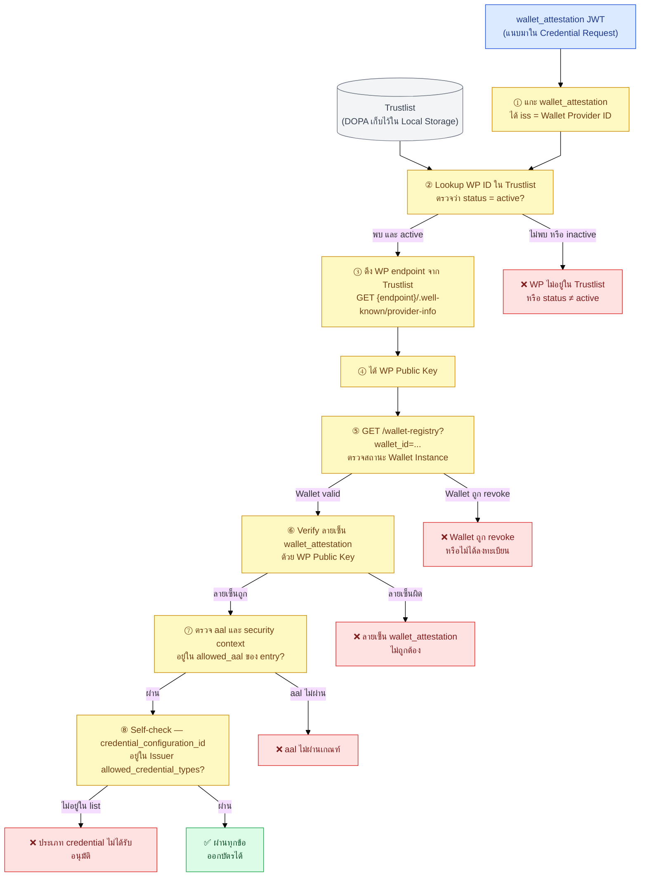
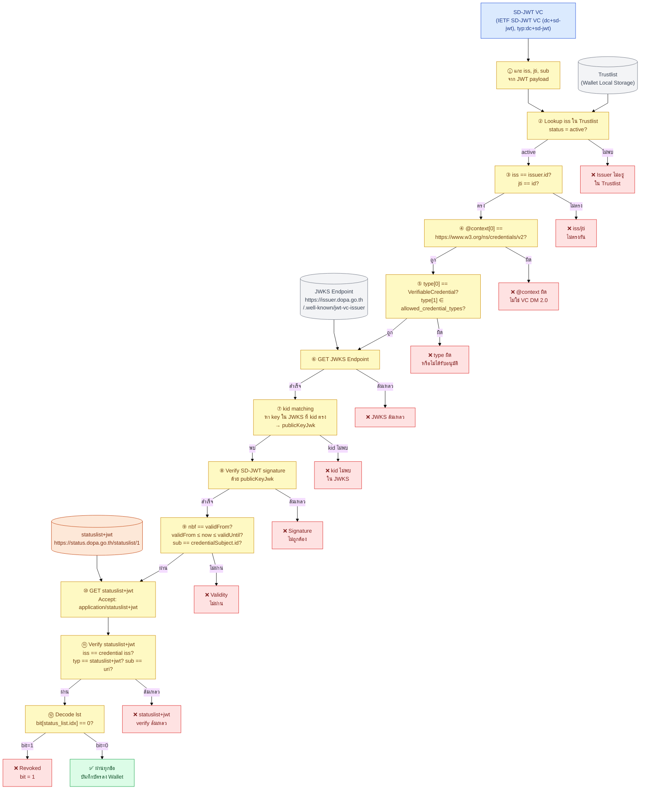
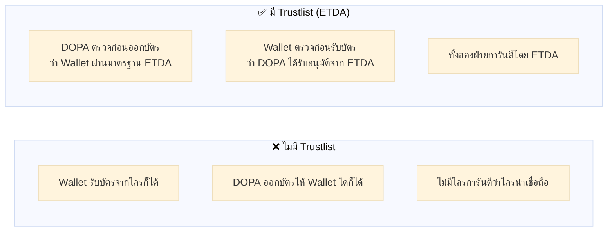

# 3.2.5 Trustlist Verification — รายละเอียดการตรวจสอบ (STEP 5.5 และ 6.5)

## 3.2.5 Trustlist Verification — รายละเอียดการตรวจสอบ (STEP 5.5 และ 6.5)

ต่อจาก [§ 3.2.4](05-issue-and-notify.md) ที่กล่าวถึงจุดตรวจ Trustlist โดยสรุปแล้ว บทนี้ขยายรายละเอียดของจุดตรวจทั้ง 2 จุด (STEP 5.5 และ 6.5) แบบ step-by-step พร้อม diagram เต็ม

ใน flow การออกบัตรประชาชนดิจิทัล มีจุดตรวจ Trustlist อยู่ **2 จุด** โดยแต่ละฝ่ายตรวจคนละบทบาท

| จุดตรวจ | ใครตรวจ | ตรวจอะไร | เกิดขึ้นตอนไหน |
|---------|---------|---------|----------------|
| STEP 5.5 | DOPA (Issuer) | Wallet Provider น่าเชื่อถือไหม? | ก่อนออกบัตร |
| STEP 6.5 | Wallet | DOPA (Issuer) น่าเชื่อถือไหม? | หลังรับบัตรมา |

---

##### STEP 5.5 — DOPA ตรวจ Wallet Provider

ก่อนออกบัตรให้ DOPA ต้องมั่นใจว่า Wallet ที่ขอรับบัตรเป็น Wallet ที่ ETDA รับรองแล้ว

**ข้อมูลที่ตรวจเทียบกับ Trustlist entry ของ WP:**

| ข้อมูลจาก wallet_attestation | เทียบกับ Trustlist entry | ต้องผ่าน |
|------------------------------|--------------------------|----------|
| `iss` (WP ID) | `entry.id` | พบและ status = active |
| ลายเซ็น JWT | `entry.public_key` (จาก WP endpoint) | verify สำเร็จ |
| `aal` (assurance level) | `entry.allowed_aal` | อยู่ใน list |
| `attested_security_context` | `entry.allowed_security_contexts` | อยู่ใน list |
| Wallet Instance ID | WP Registry | registered และ valid |
| `credential_configuration_id` (จาก Credential Request) | `Issuer.allowed_credential_types` | อยู่ใน list |

---

##### STEP 6.5 — Wallet ตรวจ Issuer (DOPA)

หลังได้รับบัตรมาแล้ว Wallet ต้องมั่นใจว่าบัตรนี้ออกโดย DOPA ที่ ETDA รับรองจริง และลายเซ็นไม่ถูกปลอมแปลง

**ข้อมูลที่ตรวจเทียบกับ Trustlist entry ของ Issuer:**

| ข้อมูลจาก SD-JWT VC | เทียบกับ Trustlist entry | ต้องผ่าน |
|---------------------|--------------------------|----------|
| `iss` | Trustlist `entry.credential_issuer` + == `issuer.id` | พบ + active + ตรง |
| `jti` | VC `id` field | `jti == id` (ต้องเท่ากัน) |
| `sub` | `credentialSubject.id` | `sub == credentialSubject.id` |
| `@context[0]` | `https://www.w3.org/ns/credentials/v2` | ต้องตรง |
| `type[0]` / `type[1]` | `"VerifiableCredential"` / `entry.allowed_credential_types` | ทั้งคู่พบ |
| `kid` (JOSE header) | JWKS `keys[].kid` | พบ key |
| SD-JWT signature | `publicKeyJwk` จาก JWKS | verify สำเร็จ |
| `nbf` ↔ `validFrom` | Unix ↔ ISO 8601 | ต้องตรงกัน |
| `validFrom` / `validUntil` | เวลาปัจจุบัน | `validFrom ≤ now ≤ validUntil` |
| `status.status_list.idx` | bit ใน `statuslist+jwt` | bit = 0 (valid) |

---

##### เปรียบเทียบ: ตรวจ Trustlist vs ไม่ตรวจ

---

*(ต่อใน [§ 3.2.6 Data Flow และ LoA/DPoP Policy](07-data-flow-and-policy.md))*
