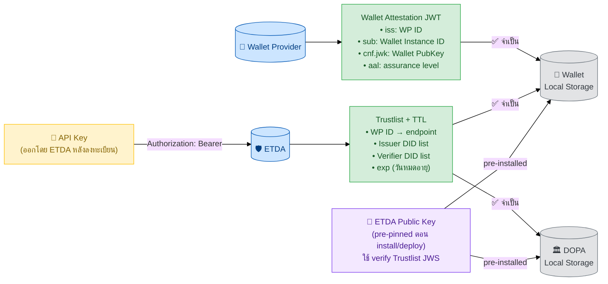
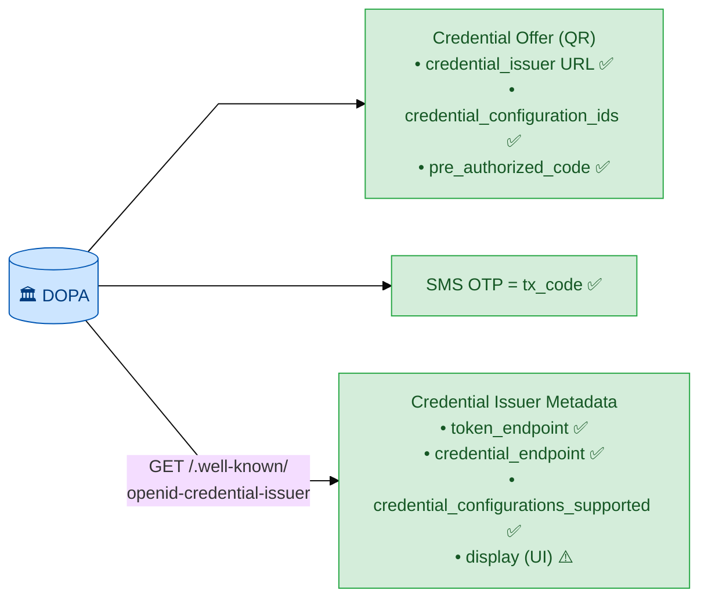
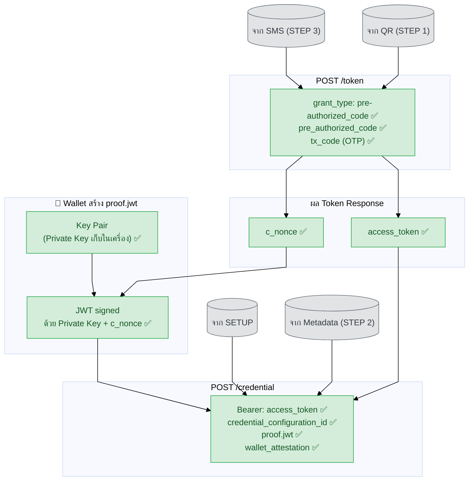
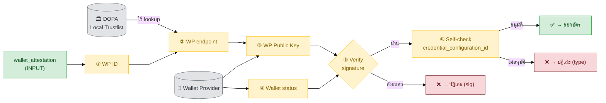
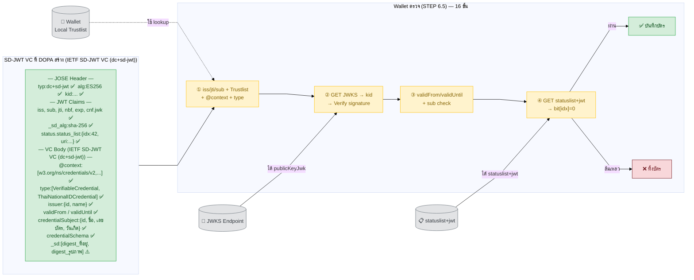
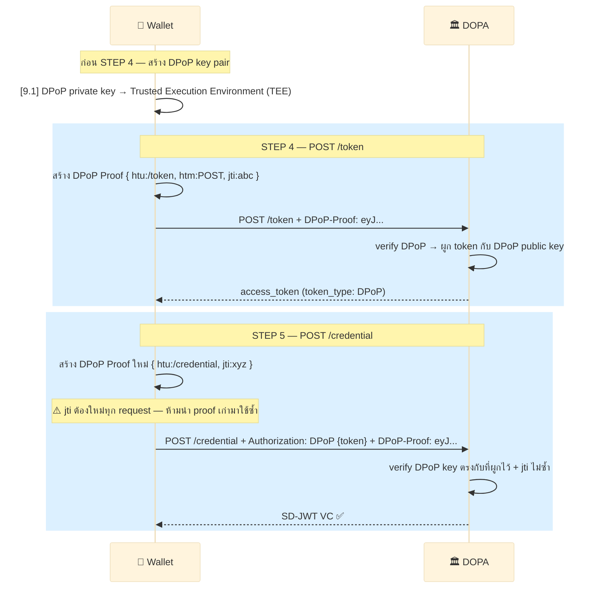

# 3.2.6 Data Flow และ LoA/DPoP Policy — รายละเอียดเพิ่มเติม

## 3.2.6 Data Flow และ LoA/DPoP Policy

ต่อจาก [§ 3.2.5](06-verification-details.md) ที่อธิบายจุดตรวจ Trustlist แบบละเอียดแล้ว บทนี้สรุปว่าแต่ละ STEP ใช้ข้อมูลอะไรบ้าง (Data Flow) และอธิบายนโยบาย LoA/DPoP ที่ควบคุมความเข้มของการป้องกัน token — เป็นบทสุดท้ายของ Issuance Flow (บทที่ 3)

##### ● SETUP — เตรียมข้อมูลก่อนเริ่ม



| ข้อมูล | มาจาก | จำเป็น | ใช้เมื่อไหน |
|--------|-------|--------|----------|
| ETDA Public Key | pre-pinned ตอน install/deploy | ✅ | SETUP — verify Trustlist JWS signature |
| API Key | ETDA (ออกให้หลังลงทะเบียน) | ✅ | SETUP — ใช้ดึง Trustlist (Authorization header) |
| Trustlist | ETDA | ✅ | STEP 5.5 และ 6.5 (lookup) |
| Wallet Attestation JWT | Wallet Provider | ✅ | STEP 5 (แนบใน Credential Request) |

---

##### ● STEP 1–3 — Credential Offer + Discovery + OTP



| ข้อมูล | มาจาก | จำเป็น | ใช้เมื่อไหน |
|--------|-------|--------|----------|
| `pre_authorized_code` | QR Code | ✅ | STEP 4 (POST /token) |
| `tx_code` (OTP) | SMS | ✅ | STEP 4 (POST /token) |
| `token_endpoint` | Credential Issuer Metadata | ✅ | STEP 4 (URL ที่จะ call) |
| `credential_endpoint` | Credential Issuer Metadata | ✅ | STEP 5 (URL ที่จะ call) |
| `credential_configuration_id` | QR Code (`credential_configuration_ids`) | ✅ | STEP 5 (ระบุประเภทบัตรใน Credential Request), [7.1] ตรวจกับ Metadata |
| `display` | Credential Issuer Metadata | ⚠️ เสริม | แสดงชื่อ/โลโก้ใน UI เท่านั้น |

---

##### ● STEP 4–5 — Token Request + Credential Request



| ข้อมูล | มาจาก | จำเป็น | หมายเหตุ |
|--------|-------|--------|----------|
| `access_token` | Token Response | ✅ | บัตรผ่านเข้า /credential |
| `token_type` | Token Response | ✅ | `DPoP` (LoA ≥ 3) หรือ `Bearer` (LoA 1) |
| `c_nonce` | Token Response | ✅ | ป้องกัน replay ใน proof |
| DPoP key pair | สร้างใน step [9.1] | ✅ (LoA ≥ 3) | private key เก็บใน Trusted Execution Environment (TEE) |
| DPoP Proof JWT | Wallet สร้างใหม่ทุก request | ✅ (LoA ≥ 3) | แนบเป็น `DPoP` header |
| Private Key | สร้างในเครื่อง | ✅ | ผูกบัตรกับ Wallet นี้ |
| `proof.jwt` | Wallet สร้างเอง | ✅ | พิสูจน์ควบคุม key |
| `credential_configuration_id` | QR Code (STEP 1) | ✅ | ระบุประเภทบัตรใน Credential Request |
| `wallet_attestation` | SETUP | ✅ | DOPA ใช้ตรวจ WP ใน STEP 5.5 |

---

##### ● STEP 5.5 — Trustlist Verification: Wallet Provider



| ข้อมูล | มาจาก | ตรวจอะไร |
|--------|-------|----------|
| WP ID | wallet_attestation | ใช้ lookup ใน Trustlist |
| WP endpoint | Local Trustlist | URL ที่จะถาม WP |
| WP Public Key | GET WP endpoint | ใช้ verify ลายเซ็น WA |
| Wallet status | GET /wallet-registry | ตรวจว่า Wallet ยังใช้งานได้ไหม |
| `credential_configuration_id` | Credential Request | ตรวจ Issuer allowed_credential_types (self-check ⑥) |

---

##### ● STEP 6–6.5 — Issue VC + Trustlist Verification: Issuer



| ข้อมูลใน VC | มาจาก | จำเป็น | หมายเหตุ |
|-----------|-------|--------|----------|
| JOSE `typ: dc+sd-jwt` | DOPA | ✅ | ระบุ format ให้ Wallet/Verifier รู้ |
| `iss` | DOPA | ✅ | = `issuer.id` (ต้องตรงกัน) |
| `sub` | Wallet (จาก proof.jwt) | ✅ | = `credentialSubject.id` |
| `jti` | DOPA | ✅ | = VC `id` field (ต้องตรงกัน) |
| `nbf` / `exp` | DOPA | ✅ | = `validFrom` / `validUntil` (Unix timestamp) |
| `_sd_alg: sha-256` | DOPA | ✅ | บังคับระบุ สำหรับ SD verification |
| `status.status_list` | DOPA | ✅ | IETF Token Status List `{idx, uri}` |
| `@context` | W3C + DOPA context | ✅ | JSON-LD semantics |
| `type` | DOPA | ✅ | `[VerifiableCredential, ThaiNationalIDCredential]` |
| `issuer: {id, name}` | DOPA | ✅ | object form |
| `validFrom` / `validUntil` | DOPA | ✅ | ISO 8601 ใน VC body |
| `credentialSubject` | ฐานข้อมูล DOPA | ✅ | ห่อทุก claims (ชื่อ, เลขบัตร, วันเกิด) |
| `credentialSchema` | DOPA | ✅ | JSON Schema URL |
| `_sd` (SD claims) | DOPA | ⚠️ เสริม | digest ของ `ที่อยู่`, `รูปภาพ` |
| `cnf.jwk` (Wallet PubKey) | จาก proof.jwt STEP 5 | ✅ | Holder Binding |
| JWKS | `issuer.dopa.go.th/.well-known/jwt-vc-issuer` | ✅ | ดึง `publicKeyJwk` มา verify |
| `statuslist+jwt` | `status.dopa.go.th/statuslist/1` | ✅ | IETF Token Status List |

---

##### ● STEP 7 — Notification (Optional)

| ข้อมูล | มาจาก | จำเป็น | หมายเหตุ |
|--------|-------|--------|----------|
| `notification_id` | Credential Response (jti ของ VC) | ⚠️ เสริม | ระบุว่า VC ใบไหน |
| `event` | Wallet กำหนด | ⚠️ เสริม | `credential_accepted` หรือ `credential_failure` |

> STEP 7 เป็น Optional — ถ้า Wallet ส่ง DOPA จะบันทึก audit log ว่าบัตรถูกรับแล้ว
> ถ้าไม่ส่ง — ไม่กระทบการใช้งานบัตร แต่ DOPA ไม่รู้ว่าบัตรถูกรับหรือเปล่า

---


### 3.2.6.1 LoA และ DPoP Policy

> **LoA (Level of Assurance)** = ระดับความมั่นใจในตัวตนของผู้ถือ VC
> ยิ่ง LoA สูง → ข้อมูลอ่อนไหวมากขึ้น → ต้องป้องกัน token ให้แข็งแกร่งขึ้น

---

#### 3.2.6.1.1 LoA แต่ละระดับหมายถึงอะไร?

| LoA | ความหมาย | วิธียืนยันตัวตน | ตัวอย่าง VC (ไทย) |
|-----|---------|----------------|-----------------|
| **LoA 1** | ความเชื่อมั่นต่ำ — สมัครด้วยตัวเอง ไม่ verify | กรอกชื่อเองโดยไม่ต้องพิสูจน์ | บัตรสมาชิก, Loyalty card |
| **LoA 2** | ความเชื่อมั่นปานกลาง — verify เอกสาร online | สแกนบัตร + OTP ออนไลน์ | ใบขับขี่ดิจิทัล, ใบรับรองวิชาชีพ |
| **LoA 3** | ความเชื่อมั่นสูง — verify ใบหน้า + เอกสาร | Biometric + เอกสารจริง (เช่น DOPA) | **บัตรประชาชน**, หนังสือเดินทาง |
| **LoA 4** | ความเชื่อมั่นสูงมาก — hardware key + biometric | Hardware token + ยืนยันตัวตน in-person | บัตรสุขภาพระดับสูง |

> **บัตรประชาชนดิจิทัลใน section 5.1 = LoA 3** ตามมาตรฐาน ETDA และ NIST SP 800-63

---

#### 3.2.6.1.2 DPoP คืออะไร ทำไมต้องมี?

**DPoP (Demonstrating Proof of Possession)** ผูก access_token กับ key ของ Wallet โดยเฉพาะ — ขโมย token ไปใช้จากที่อื่นไม่ได้

**โดยไม่มี DPoP:**
```
Wallet ได้ access_token "eyJhbG..." ← Bearer token
Attacker ขโมย token ไป
Attacker POST /credential + token ที่ขโมยมา → ได้บัตรของเหยื่อ 😱
```

**เมื่อมี DPoP:**
```
Wallet สร้าง DPoP key pair (private key อยู่ใน Wallet เท่านั้น)
Wallet ได้ access_token ที่ผูกกับ DPoP public key
Attacker ขโมย token ไป แต่ไม่มี DPoP private key
Attacker POST /credential → DOPA ตรวจ DPoP ไม่ผ่าน → 401 ❌
```

---

#### 3.2.6.1.3 DPoP Policy: ใช้เมื่อไหร่?

| LoA | tx_code (OTP) | Wallet Attestation | DPoP | เหตุผล |
|-----|-------------|-------------------|------|--------|
| **LoA 1** | ⚪ ไม่บังคับ | ⚪ ไม่บังคับ | ⚪ ไม่บังคับ — Bearer OK | ข้อมูลไม่ sensitive ถ้าหายออกใหม่ได้ง่าย |
| **LoA 2** | ✅ แนะนำ | 🟡 แนะนำ | 🟡 แนะนำ (SHOULD) | ข้อมูลสำคัญ ควรป้องกัน |
| **LoA 3** | ✅ บังคับ | ✅ บังคับ | ✅ บังคับ (MUST) | ข้อมูล identity หลัก — HAIP กำหนด |
| **LoA 4** | ✅ บังคับ | ✅ บังคับ | ✅ บังคับ + hardware key | ข้อมูลอ่อนไหวสูงสุด |

---

#### 3.2.6.1.4 DPoP ทำงานอย่างไรใน Pre-Auth Flow?

DPoP เพิ่มใน 2 จุด — **STEP 4** (แลก token) และ **STEP 5** (ขอบัตร)



---

#### 3.2.6.1.5 Trustlist Entry ต้องระบุ LoA และ DPoP requirement

เพื่อให้ Issuer รู้ว่า VC ประเภทนี้ต้องบังคับ DPoP ระดับไหน:

```json
// ตัวอย่าง entry ใน Trustlist สำหรับ credential configuration
{
  "credential_configuration_id": "ThaiNationalIDCredential-config",
  "required_loa": 3,
  "require_dpop": true,
  "require_wallet_attestation": true,
  "require_tx_code": true
}
```

```json
{
  "credential_configuration_id": "MembershipCard-config",
  "required_loa": 1,
  "require_dpop": false,
  "require_wallet_attestation": false,
  "require_tx_code": false
}
```

---

#### 3.2.6.1.6 สิ่งที่ Issuer ต้องตรวจใน STEP 4 ตาม LoA

| การตรวจ | LoA 1 | LoA 2 | LoA 3 | LoA 4 |
|---------|:-----:|:-----:|:-----:|:-----:|
| `pre_authorized_code` valid + single-use | ✅ | ✅ | ✅ | ✅ |
| `tx_code` (OTP) ถูกต้อง | ⚪ | ✅ | ✅ | ✅ |
| Wallet Attestation ถูกต้อง | ⚪ | 🟡 | ✅ | ✅ |
| DPoP-Proof header มีและถูกต้อง | ⚪ | 🟡 | ✅ | ✅ |
| DPoP `jti` ไม่ซ้ำ (replay protection) | ⚪ | 🟡 | ✅ | ✅ |
| Hardware-backed key | ⚪ | ⚪ | ⚪ | ✅ |

---

จบเนื้อหาบทที่ 3 (กระบวนการออกเอกสาร) ทั้งหมด — บทถัดไปคือ [บทที่ 4 กระบวนการแสดงเอกสาร (OID4VP)](../../04-presentation-flow/01-overview/index.md) ซึ่งอธิบายว่าเมื่อ Holder มี VC อยู่ใน Wallet แล้ว จะแสดงให้ Verifier ตรวจสอบอย่างไร
