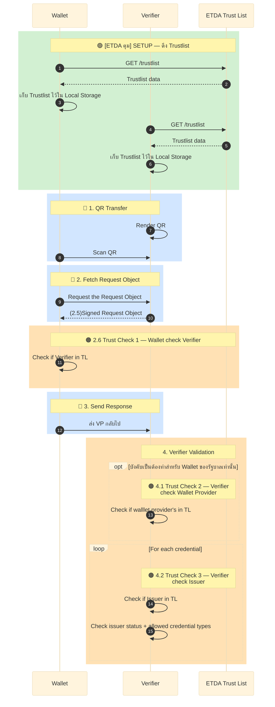
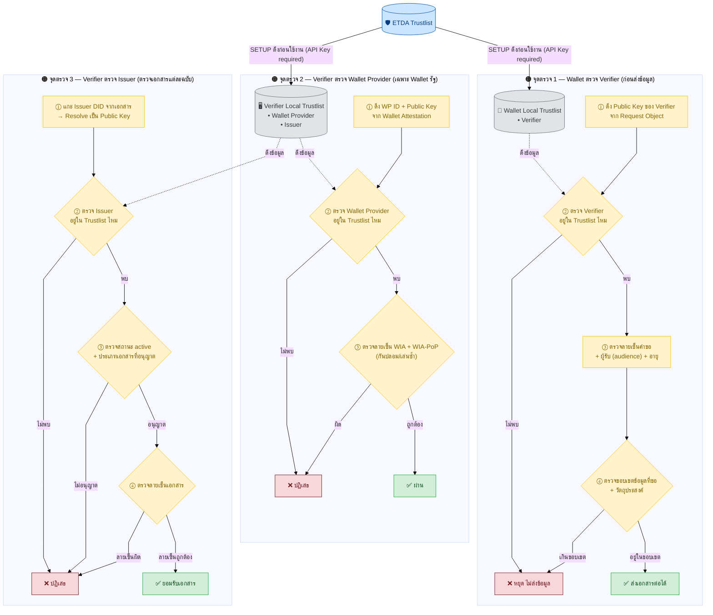

# 4.1 กระบวนการแสดงและตรวจสอบเอกสาร (OID4VP)

ต่อจาก [บทที่ 3 กระบวนการออกเอกสาร (OID4VCI)](../../03-issuance-flow/01-minimal-flow.md) ที่ Holder ได้รับ VC มาเก็บใน Wallet แล้ว บทนี้อธิบายอีกฝั่งหนึ่งของวงจรชีวิต VC — เมื่อ Holder ต้องการ **แสดง** เอกสารนั้นให้ผู้ตรวจสอบ (Verifier) ดู ระบบตรวจสอบความน่าเชื่อถืออย่างไร

## 4.1 ภาพรวมขั้นตอนการแสดงและตรวจสอบเอกสาร (OID4VP + Trustlist)

**สีกรอบในผังหมายถึงอะไร:**

| สี | หมายถึง | ใครกำหนด |
|----|---------|----------|
| 🟢 สีเขียว | ขั้นตอนที่ ETDA ดูแลโดยตรง (Trustlist) | ETDA |
| 🔵 สีน้ำเงิน | ขั้นตอนตามมาตรฐาน OID4VP สากล | OpenID Foundation |
| 🟠 สีส้ม | จุดตรวจสอบ trust ว่าใครน่าเชื่อถือ | Trust Framework (ETDA) |

**Trustlist Verification — จุดตรวจที่ ETDA คุม (3 จุดใน flow):**

ในการแสดงเอกสาร มีจุดตรวจ Trustlist อยู่ **3 จุด** โดยตรวจกันคนละฝั่ง คือ กระเป๋าดิจิทัลตรวจผู้ตรวจสอบก่อนส่งข้อมูล 1 จุด และผู้ตรวจสอบตรวจฝั่งกระเป๋า/ผู้ออกเอกสารอีก 2 จุด

> หมายเหตุ: หลังผ่านจุดตรวจ 3 แล้ว ผู้ตรวจสอบยังเช็ค **สถานะเอกสาร** (ถูกยกเลิก/พักใช้หรือไม่) ต่ออีกขั้นหนึ่ง แต่ขั้นนี้ดึงข้อมูลจาก Status List ของผู้ออกเอกสาร ไม่ได้ใช้ ETDA Trustlist จึงไม่นับรวมใน 3 จุดข้างต้น (ดูรายละเอียดใน [4.2.1 Full Flow](../02-full-flow/02b-full-flow-technical-detail.md))

ขั้นตอนการทำงานทั้งหมดของ flow นี้ อ่านต่อได้ในหน้าถัดไป: [4.2 SETUP, สแกน QR, คำขอฉบับสมบูรณ์, ตรวจ Verifier](02-setup-and-request.md) และรายละเอียดทางเทคนิคทุกขั้นตอนที่ [4.2.1 Full Flow เทคนิคโดยละเอียด](../02-full-flow/02b-full-flow-technical-detail.md) (ซ่อนโดยดีฟอลต์ คลิกเพื่อดู)
