# 4.2.1 Full Flow เทคนิคโดยละเอียด — OID4VP (การแสดงและตรวจ VC)

> เนื้อหาในบทนี้เป็นรายละเอียดทางเทคนิคระดับ field-by-field ของขั้นตอนการแสดงและตรวจ VC (OID4VP) ทั้งหมด เหมาะสำหรับผู้พัฒนาและสถาปนิกระบบที่ต้องการรายละเอียดครบทุกขั้นตอน (นับจากคำอธิบายภาพรวมใน [4.1.1](../01-overview/02-setup-and-request.md))
>
> คลิกที่หัวข้อด้านล่างเพื่อดูเนื้อหาแบบเต็ม (ซ่อนไว้โดยดีฟอลต์เพื่อไม่ให้หน้าเอกสารยาวเกินไป)

<details>
<summary><strong>📖 คลิกเพื่อดู Full Flow เทคนิคทั้งหมด (Sequence Diagram + คำอธิบายทุกขั้นตอน)</strong></summary>

## Sequence Diagram ฉบับเต็ม

```mermaid
%%{init: {"theme":"base","themeVariables":{"fontSize":"15px"},"flowchart":{"useMaxWidth":true,"htmlLabels":true,"curve":"linear"}}}%%
sequenceDiagram
    autonumber
    participant U as User
    participant C as Holder + Wallet Instance<br/>Key Store
    participant W as Wallet (Holder)
    participant V as Verifier (RP)
    participant TL as ETDA Trust List<br/>(signed by ETDA)
    participant UR as Universal DID Resolver
    participant IR as Issuer Registry<br/>(credential status endpoint)

    %% =========================================
    rect rgb(210, 240, 210)
        note over W,TL: 🟢 [ETDA คุม] SETUP — ดึง ETDA Public Key + Trustlist
        W->>TL: GET https://trust.etda.or.th/.well-known/trust-anchor
        TL-->>W: ETDA Public Key (JWK)
        W->>W: เก็บ ETDA Public Key ไว้ใน Local Storage
        V->>TL: GET https://trust.etda.or.th/.well-known/trust-anchor
        TL-->>V: ETDA Public Key (JWK)
        V->>V: เก็บ ETDA Public Key ไว้ใน Local Storage
        W->>TL: GET /trustlist + Authorization: Bearer ***
        TL-->>W: Trustlist JSON + Detached JWS Signature
        W->>W: Verify Detached JWS ด้วย ETDA Public Key
        W->>W: เก็บ Trustlist + บันทึก TTL (exp claim)
        V->>TL: GET /trustlist + Authorization: Bearer ***
        TL-->>V: Trustlist JSON + Detached JWS Signature
        V->>V: Verify Detached JWS ด้วย ETDA Public Key
        V->>V: เก็บ Trustlist + บันทึก TTL (exp claim)
    end

    rect rgb(210, 230, 255)
    Note over V: 📋 Step 1 — Prepare Authorization Request
    V->>V: Generate nonce, state, request_id
    V->>V: Build Request Object JWT incl. dcql_query<br/>(format: "dc+sd-jwt")
    V->>V: Sign with Verifier key 
    V->>V: Render QR
    end

    rect rgb(210, 230, 255)
    Note over W,V: 📱 Step 2 — Cross-device transfer
    U->>V: Access RP website
    V-->>U: Display QR
    U->>W: Scan QR
    end

    rect rgb(210, 230, 255)
    Note over W,V: 📥 Step 2.5 — Fetch Request Object
    W->>V: Request the Request Object
    V-->>W: Signed Request Object JWT (with dcql_query)
    end

    %% =========================================
    rect rgb(255, 225, 180)
    Note over W,TL: 🔍 Between 2.5 and 3 — Verifier trust + DCQL scope

    W->>W: Parse RO Extract PK_v

    alt TL cached & fresh
        W->>W: Load cached TL
    else
        W->>TL: GET ETDA Trust List
        TL-->>W: TL { verifier_entries[],<br/>      issuer_entries[],<br/>      wallet_provider_entries[] }
        W->>W: 🔎 L1: Verify TL signature with ETDA public key
        W->>W: Cache with TTL
    end

    W->>W: 🔎 L2: Lookup at TL.verifier_entries[]<br/>WHERE entry.PK_v == PK_v
    alt Not found OR status ≠ active
        W--xV: Abort — untrusted_verifier
    else Found
        W->>W: Verify RO sig with entry.PUBkey (PK_v)<br/>aud == wallet id, exp/iat,<br/>nonce structural ≥128-bit<br/>dcql_query.claims paths ⊆ entry.allowed_attributes<br/>purpose ∈ entry.allowed_purposes
        W->>W: Store session ctx
    end
    end

    %% =========================================
    rect rgb(210, 230, 255)
    Note over W,U: ✅ Step 3 — DCQL local match + Consent
    W->>W: For each q in dcql_query.credentials:<br/>filter local SD-JWT VCs by q.format=="dc+sd-jwt"<br/>+ q.meta.vct_values (vct claim)<br/>walk q.claims[].path natively in each candidate
    W->>W: Evaluate credential_sets (required options satisfied?)
    W->>U: Show consent UI (legal_name, purpose, matched claims)
    U->>W: Approve, pick option per set, select claims to disclose
    W->>C: Unlock holder + wallet instance keys
    C-->>W: Authorized
    end

    %% =========================================
    rect rgb(210, 230, 255)
    Note over W,C: 🔐 Step 4 — Build per-id SD-JWT Presentation + WIA-PoP

    loop For each picked q.id
        W->>W: Select disclosures matching q.claims[].path<br/>Drop non-selected disclosures<br/>Concatenate: issuer_jwt~d1~d2~...~
        W->>W: Compute sd_hash = SHA-256 of<br/>the presentation up to and including trailing ~
        W->>C: Sign KB-JWT with holder key<br/>header: { typ: "kb+jwt", alg }<br/>payload: { iss=holder,<br/>  aud=client_id,<br/>  nonce=⟨V nonce⟩,<br/>  sd_hash, iat }
        C-->>W: KB-JWT
        W->>W: Assemble vp_token[q.id] =<br/>issuer_jwt~d1~d2~...~KB-JWT<br/>(SD-JWT VC presentation format)
    end
    W->>C: Sign WIA-PoP with Wallet Instance key<br/>{ iss=wallet instance ID, aud=client_id,<br/>  nonce=⟨V nonce⟩, jti, iat, exp }
    C-->>W: wia_pop
    end

    rect rgb(210, 230, 255)
    Note over W,V: 📤 Step 5 — Authorization Response (direct_post.jwt)
    W->>V: POST response_uri {<br/>  vp_token: { id → SD-JWT presentation string },<br/>  wallet_attestation: ⟨WIA⟩,<br/>  wallet_attestation_pop: ⟨WIA-PoP⟩,<br/>  state }
    V-->>W: 200 OK
    end

    %% =========================================
    rect rgb(255, 225, 180)
    Note over V,IR: 🔎 Step 6 — Verifier validates

    V->>V: Recover { issued_nonce, client_id, dcql_query } by state

    Note over V,TL: ⓪ Wallet Instance Attestation
    V->>V: Parse WIA → extract WP iss + PK_wp

    alt TL cached & fresh (Verifier side)
        V->>V: Use cached TL
    else
        V->>TL: GET ETDA Trust List
        TL-->>V: TL artefact
        V->>V: 🔎 L1: Verify TL sig with ETDA public key
        V->>V: Cache with TTL
    end

    V->>V: 🔎 L3: Lookup at TL.wallet_provider_entries[]<br/>WHERE entry.PK_wp == PK_wp
    alt Not found
        V--xW: 400 untrusted_wallet_provider
    else Found
        V->>V: Verify WIA sig with entry.PUBkey (PK_wp)<br/>WIA: iat ≤ now < exp
        V->>V: Verify WIA-PoP sig with WIA.cnf.jwk<br/>iss == WIA.sub, aud == client_id,<br/>nonce == issued_nonce, jti not consumed
        V->>V: Mark WIA-PoP jti consumed
    end

    Note over V: Per-id DCQL loop
    loop For each q in dcql_query.credentials
        V->>V: Look up vp_token[q.id]<br/>Split by ~ →<br/>{ issuer_jwt, disclosures[], KB-JWT }

        Note over V,UR: ① KB-JWT — holder binding (SD-JWT native)
        V->>V: Parse issuer_jwt (typ:"dc+sd-jwt")<br/>Extract cnf.jwk (holder key confirmation)<br/>Extract iss (issuer DID), kid
        V->>V: Parse KB-JWT (typ:"kb+jwt")
        V->>V: Verify KB-JWT sig with issuer_jwt.cnf.jwk<br/>aud == client_id<br/>nonce == issued_nonce<br/>iat recent
        V->>V: Recompute sd_hash over<br/>issuer_jwt~d1~d2~...~<br/>Confirm KB-JWT.sd_hash matches
        V->>V: Mark nonce + KB-JWT jti consumed

        Note over V,TL: ② Issuer JWT — issuer PUBkey + TL authority
        V->>UR: GET /1.0/identifiers/⟨issuer DID⟩
        UR-->>V: DID Resolution Result
        V->>V: 🔎 L6: Dereference kid in didDocument<br/>WHERE kid ∈ doc.assertionMethod[]<br/>→ publicKeyJwk (PK_iss)<br/>

        V->>V: 🔎 L4: Lookup at TL.issuer_entries[]<br/>WHERE entry.PK_iss == PK_iss
        alt Not found
            V--xW: 400 untrusted_issuer (key)
        else Found
            V->>V: Check entry.status == active<br/>now ∈ [key_valid_from, key_valid_until]<br/>issuer_jwt.vct ∈ entry.allowed_credential_types<br/>DID method ∈ entry.allowed_did_methods

            alt Policy check fails
                V--xW: 400 untrusted_issuer (policy)
            else
                V->>V: Verify issuer_jwt sig with PK_iss<br/>nbf ≤ now ≤ exp<br/>_sd_alg supported (e.g. "sha-256")

                V->>V: For each disclosure d in disclosures[]:<br/>compute hash(d) with _sd_alg<br/>confirm hash(d) ∈ issuer_jwt._sd<br/>parse d = [salt, claim_name, claim_value]<br/>build reconstructed_credential
                alt Any disclosure hash mismatch
                    V--xW: 400 invalid_disclosure
                end

                V->>V: DCQL match against reconstructed_credential:<br/>vct ∈ q.meta.vct_values?<br/>Each c in q.claims:<br/>walk c.path → value present<br/>If specific values required → check value matches one of them
                alt DCQL match fails
                    V--xW: 400 dcql_failed
                end

                opt status claim present
                    V->>V: Read status.status_list { uri, idx }
                    alt Cached & fresh
                        V->>V: Use cached statuslist+jwt
                    else
                        V->>IR: GET status.status_list.uri<br/>Accept: application/statuslist+jwt
                        IR-->>V: statuslist+jwt
                        V->>V: Verify statuslist JWS:<br/>typ == "statuslist+jwt",<br/>sub == URI of the Status List,<br/>now > iat,<br/>now < exp,<br/>signed by PK_iss (already from L6)
                    end
                    V->>V: 🔎 L7: Decode lst (base64url → zlib)<br/>Extract entry at status_list.idx<br/>(LSB-first, bits-per-entry from header)
                    alt 0x00 VALID
                        Note over V: ✅ Active
                    else 0x01 INVALID
                        V--xW: 400 credential_revoked
                    else 0x02 SUSPENDED
                        V--xW: 400 credential_suspended
                    end
                end
            end
        end
    end

    Note over V: ③ credential_sets evaluation
    V->>V: For each required set:<br/>some option in set.options where every id satisfied
    alt Some required set unsatisfied
        V--xW: 400 credential_set_unsatisfied
    end
    end

    alt All checks pass
        V-->>U: ✅ Service granted
    else Any failure
        V-->>W: 400 invalid_request (specific code)
    end
```



## คำอธิบายทุกขั้นตอน

#### 🟢 SETUP — ดึง ETDA Public Key + Trustlist

Wallet และ Verifier ต่างดึง ETDA Public Key จาก `GET /.well-known/trust-anchor` เก็บไว้ใช้ verify ลายเซ็นของ Trustlist จากนั้นดึง Trustlist ผ่าน `GET /trustlist` (ต้องแนบ API Key) พร้อม Detached JWS Signature แล้ว verify ด้วย ETDA Public Key ก่อนเก็บพร้อม TTL (exp claim) — ขั้นตอนนี้เป็นจุดเริ่มของ trust chain ทั้งหมดในฝั่งการแสดง VC เช่นเดียวกับฝั่งการออก VC (ดู [3.1 Minimal Flow](../../03-issuance-flow/01-minimal-flow.md)) แต่ที่นี่ทั้ง Wallet และ **Verifier** ต่างเป็นผู้ดึง Trustlist เอง (ไม่ใช่ Wallet กับ Issuer/DOPA เหมือนในบทที่ 3)

#### 📋 Step 1 — ผู้ตรวจสอบเตรียมคำขอ

**ฝั่ง Verifier ดำเนินการ**:
1. **สร้างค่าสุ่ม** — nonce (สำหรับป้องกันการเล่นซ้ำ), state (เก็บข้อมูลธุรกรรมฝั่ง Verifier), request_id
2. **สร้าง Request Object** ในรูปแบบ JWT บรรจุ `dcql_query` ที่ระบุว่าต้องการเอกสารประเภทใด (format: `dc+sd-jwt`) และต้องการข้อมูลอะไรบ้าง
3. **ลงนาม** Request Object ด้วยกุญแจส่วนตัวขององค์กร (รูปแบบของกุญแจส่วนตัวใช้ตามที่ oid4vp กำหนด เช่น x509_hash, decentralized_identifier หรืออื่น ๆ แต่ต้องเป็นแบบที่ wallet รองรับ เพื่อให้ทำงานร่วมกันได้)
4. **สร้าง QR Code** ที่มีลิงก์ไปยัง Request Object เต็ม (request_uri)

---

#### 📱 Step 2 — การถ่ายโอนข้ามอุปกรณ์

**ฝั่ง User และ Wallet**:
1. ผู้ใช้เข้าใกล้จุดให้บริการของผู้ตรวจสอบ
2. ผู้ตรวจสอบแสดง QR Code บนจอ
3. ผู้ใช้ใช้กระเป๋าดิจิทัลบนโทรศัพท์สแกน QR Code

---

#### 📥 Step 2.5 — ดึง Request Object ฉบับสมบูรณ์

**ฝั่ง Wallet**:
1. กระเป๋าดิจิทัลส่ง HTTP GET ไปยัง `request_uri` ที่ระบุใน QR Code
2. ผู้ตรวจสอบตอบกลับด้วย Request Object JWT ฉบับเต็มที่ได้ลงนามแล้ว

**เหตุผล**: QR Code มีขนาดจำกัด บรรจุ Request Object ทั้งหมดไม่ได้ จึงส่งเป็นลิงก์แทน

---

#### 🟠 จุดตรวจสอบที่ 1 — ตรวจ Verifier (ระหว่าง Step 2.5 และ Step 3)

**ความสำคัญ**: นี่คือจุดควบคุมความปลอดภัยที่สำคัญที่สุดของฝั่งกระเป๋าดิจิทัล ต้องผ่านการตรวจนี้ก่อน จึงจะยอมส่งข้อมูลใด ๆ

**การดำเนินการ**:
1. **แยก Request Object** เพื่อดึง public key ของผู้ตรวจสอบ  
2. **ตรวจสอบ Trust List** — ใช้สำเนาในเครื่องหากยังไม่หมดอายุ มิฉะนั้นดึงใหม่และตรวจลายมือชื่อด้วยกุญแจ ETDA (**L1**)
3. **ค้นหา PK_v ใน `verifier_entries`** ของ Trust List  (**L2**)
4. **หากไม่พบ** — หยุดกระบวนการทันที ไม่ส่งข้อมูลใด ๆ ให้ผู้ตรวจสอบที่ไม่ได้รับการรับรอง
5. **หากพบ** — ดำเนินการตรวจต่อ ได้แก่
   - ตรวจลายมือชื่อของ Request Object ด้วยกุญแจในรายการ
   - ยืนยัน audience, ระยะเวลาใช้งาน, ความถูกต้องของใบรับรอง
   - ตรวจว่าโดเมนตรงกับที่ลงทะเบียนไว้
   - ตรวจ nonce มีความยาวเพียงพอ
   - **ตรวจขอบเขตข้อมูล** — สิ่งที่ Verifier ขอต้องอยู่ในขอบเขตที่ได้รับอนุญาต
   - ตรวจว่าวัตถุประสงค์อยู่ในรายการที่ได้รับอนุญาต

---

#### ✅ Step 3 — DCQL Local Match และการขอความยินยอม

**ฝั่ง Wallet**:
1. **DCQL Match** — สำหรับคำขอแต่ละรายการใน `dcql_query`
   - กรองเอกสาร SD-JWT VC ในเครื่องด้วย format และ `vct_values`
   - เดินตาม path ที่ระบุใน claims เพื่อหา disclosure ที่ตรงเงื่อนไข
2. **ประเมิน credential_sets** — ตรวจว่าเอกสารในเครื่องสามารถตอบสนองเงื่อนไขที่จำเป็นได้หรือไม่
3. **แสดง Consent UI** — บอกผู้ใช้ว่า
   - Verifier คือใคร (legal_name จาก Trust List)
   - วัตถุประสงค์ในการขอ
   - Claim ที่จะเปิดเผย
4. **ผู้ใช้ตัดสินใจ** — เลือก option ที่จะใช้ (กรณีมีหลายทางเลือก) และเลือกเอกสาร
5. **ปลดล็อกกุญแจ** — ผู้ใช้ยืนยันตัวตนผ่าน biometric หรือ PIN เพื่อปลดล็อกกุญแจ holder และ wallet instance

---

#### 🔐 Step 4 — สร้าง SD-JWT Presentation และ WIA-PoP

**ฝั่ง Wallet** สำหรับเอกสารแต่ละฉบับที่ผู้ใช้เลือก:

1. **เลือก Disclosures** — เก็บเฉพาะ disclosure ที่ตรงกับ claims path ที่ Verifier ขอ ทิ้งที่เหลือ
2. **ประกอบ Presentation** — ต่อกันด้วยเครื่องหมาย `~`
   ```
   issuer_jwt~disclosure_1~disclosure_2~...~
   ```
3. **คำนวณ sd_hash** — SHA-256 ของทั้ง presentation ข้างต้น (รวม `~` สุดท้าย)
4. **สร้าง KB-JWT (Key Binding JWT)** ลงนามด้วยกุญแจ holder
   - Header: `typ: "kb+jwt"`
   - Payload: audience (client_id), nonce (จาก Verifier), sd_hash, iat
5. **ประกอบขั้นสุดท้าย** ต่อ KB-JWT ต่อท้าย
   ```
   issuer_jwt~disclosure_1~disclosure_2~...~KB-JWT
   ```
   นี่คือ `vp_token[q.id]`

**สร้าง WIA-PoP** เพิ่มเติม — Proof of Possession ของกระเป๋าดิจิทัล ลงนามด้วยกุญแจ wallet instance บรรจุ nonce, audience, iat, exp

**หมายเหตุ**: SD-JWT VC ไม่ต้องมี JWT-VP ห่ออีกชั้น เพราะ **KB-JWT ทำหน้าที่ Holder Binding ในตัว**

---

#### 📤 Step 5 — ส่งเอกสารตอบกลับ

**ฝั่ง Wallet** ส่ง HTTP POST ไปยัง `response_uri` ในรูปแบบ `direct_post.jwt` (JWE) ประกอบด้วย
- `vp_token` — object ที่ key เป็น id จาก DCQL, value เป็น SD-JWT presentation string
- `wallet_attestation` — WIA (Wallet Instance Attestation)
- `wallet_attestation_pop` — WIA-PoP
- `state` — สำหรับเชื่อมโยงกับธุรกรรมฝั่ง Verifier

---

#### 🔎 Step 6 — ผู้ตรวจสอบดำเนินการตรวจสอบ

Verifier เริ่มจากค้นหาบริบทของธุรกรรมจาก state ที่ได้รับ

##### 🟠 จุดตรวจสอบที่ 2 — ตรวจ Wallet Provider (Step 6 ⓪)

**วัตถุประสงค์**: ยืนยันว่าแอปกระเป๋าดิจิทัลที่ส่งข้อมูลมาเป็นของแท้และได้รับการรับรอง

**การดำเนินการ**:
1. **แยก WIA** เพื่อดึงกุญแจสาธารณะของผู้ให้บริการกระเป๋าดิจิทัล (PK_wp) 
2. **โหลด Trust List** (ใช้สำเนาหรือดึงใหม่)
3. **ค้นหา PK_wp ใน `wallet_provider_entries`** (**L3**)
4. **หากไม่พบ** — ปฏิเสธด้วย `untrusted_wallet_provider`
5. **หากพบ** — ตรวจต่อ
   - ตรวจลายมือชื่อของ WIA ด้วย PK_wp (WIA: iat ≤ now < exp)
6. **ตรวจ WIA-PoP** — ยืนยันว่ากระเป๋าดิจิทัลกำลังทำงานในธุรกรรมนี้จริง
   - ลายมือชื่อของ WIA-PoP ตรงกับกุญแจใน `WIA.cnf.jwk`
   - nonce ตรงกับที่ส่งไป
   - jti ยังไม่ถูกใช้ (ป้องกันการเล่นซ้ำ)

##### วนตรวจเอกสารแต่ละฉบับใน `vp_token`

สำหรับเอกสารแต่ละรายการ Verifier ดำเนินการดังนี้

###### แยก Presentation

**ตัด `vp_token[q.id]` ด้วยเครื่องหมาย `~`** → ได้ 3 ส่วน คือ issuer_jwt, disclosures[], และ KB-JWT

###### ① ตรวจ KB-JWT — Holder Binding

1. **แยก issuer_jwt** เพื่อดึงกุญแจของ holder จาก `cnf.jwk` และ issuer DID
2. **แยก KB-JWT** (typ: `kb+jwt`)
3. **ตรวจลายมือชื่อ KB-JWT** ด้วย `issuer_jwt.cnf.jwk`
   - audience ตรงกับ client_id
   - nonce ตรงกับที่ส่งไป
   - iat เป็นเวลาปัจจุบัน
4. **คำนวณ sd_hash ใหม่** จาก presentation แล้วเทียบกับที่ระบุใน KB-JWT
   - ป้องกันการ tampering ระหว่างทาง
5. **บันทึกการใช้ nonce และ jti** เพื่อป้องกันการเล่นซ้ำ

**หมายเหตุ**: SD-JWT VC ตรวจ holder binding ผ่าน `cnf.jwk` โดยตรง ไม่ต้องพึ่ง DID Resolver สำหรับ holder

##### 🟠 จุดตรวจสอบที่ 3 — ตรวจ Issuer (Step 6 ②)

###### หา Public Key ของ Issuer

1. **Resolve issuer DID** ผ่าน Universal DID Resolver (**L6**)
2. ดึง publicKeyJwk (PK_iss) จาก DID Document ที่ตรงกับ kid ใน issuer_jwt

###### ตรวจใน Trust List

3. **ค้นหา PK_iss ใน `issuer_entries`**  (**L4**)
4. **หากไม่พบ** — ปฏิเสธด้วย `untrusted_issuer (key)`
5. **ตรวจสถานะและ policy**
   - สถานะ = active
   - อยู่ในช่วงเวลาที่กุญแจใช้งานได้
   - `vct` ของเอกสารอยู่ในประเภทที่ Issuer ได้รับอนุญาตให้ออก
   - DID method ที่ใช้อยู่ในรายการที่อนุญาต

###### ตรวจ Issuer JWT และ Disclosures

6. **ตรวจลายมือชื่อของ issuer_jwt** ด้วย PK_iss
7. **ตรวจ Disclosures แต่ละรายการ**
   - Hash disclosure ด้วย `_sd_alg` (เช่น sha-256)
   - ตรวจว่า hash ที่ได้อยู่ในรายการ `_sd` ของ issuer_jwt
   - ถ้าไม่ตรง → ปฏิเสธด้วย `invalid_disclosure`
   - ถ้าตรง → แยก `[salt, claim_name, claim_value]` แล้วนำมาประกอบเป็น credential ที่ reconstructed
8. **DCQL Match** — ตรวจกับ credential ที่ reconstructed แล้ว
   - `vct` ตรงกับที่ขอ
   - Claims ที่ path ระบุมีอยู่จริง
   - ถ้าระบุ values ที่ต้องการ → ตรวจว่า value ตรงกับหนึ่งในนั้น

##### 🟠 จุดตรวจสอบที่ 4 — ตรวจสถานะเอกสาร

**หาก issuer_jwt มี `status` claim**

1. **อ่าน uri และ idx** จาก `status.status_list`
2. **โหลด status list** — ใช้สำเนาหรือดึงใหม่จาก Issuer Registry
3. **ตรวจลายมือชื่อของ statuslist+jwt**
   - typ = `statuslist+jwt`
   - sub ตรงกับ URI ของ Status List
   - now > iat, now < exp
   - ลงนามด้วย PK_iss ที่ได้จาก L6
4. **แตกและถอด bitstring** (**L7**)
   - base64url decode
   - zlib decompress
   - ดึง bit ที่ตำแหน่ง idx (LSB-first)
5. **ตีความสถานะ**
   - `0x00` = VALID → ✅ ผ่าน
   - `0x01` = INVALID → ปฏิเสธด้วย `credential_revoked`
   - `0x02` = SUSPENDED → ปฏิเสธด้วย `credential_suspended`

##### ③ ตรวจความครบถ้วนของ credential_sets

Verifier ตรวจว่าเอกสารที่ได้รับครอบคลุมเงื่อนไข `credential_sets` ที่จำเป็นทุกรายการ

- สำหรับ set ที่ `required: true` ต้องมีอย่างน้อยหนึ่ง option ที่ทุก id ในนั้นได้รับการยืนยันครบถ้วน
- หากมี set ที่จำเป็นแต่ไม่ครบ → ปฏิเสธด้วย `credential_set_unsatisfied`

</details>
