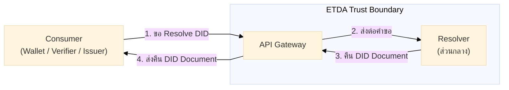
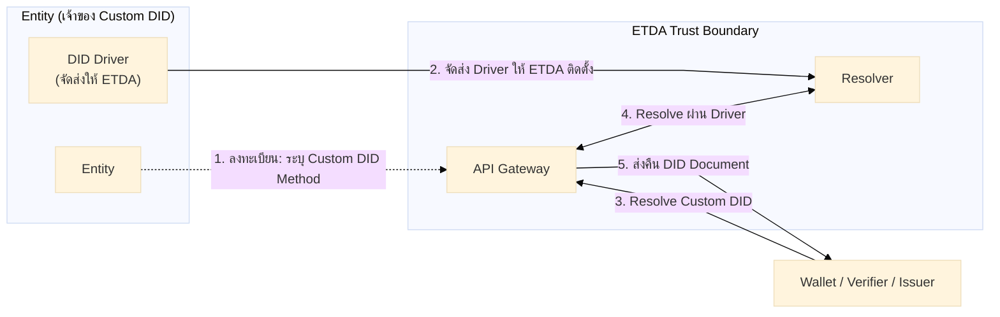
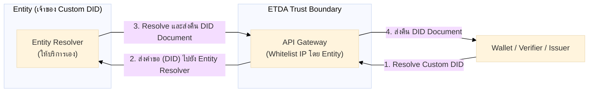

# 6.1 ระดับความเชื่อมั่นของ Verifier และการลงทะเบียน

ต่อจาก [บทที่ 5 โครงสร้างพื้นฐานความน่าเชื่อถือ](../05-trust-infrastructure/01-technical-requirements-and-schema.md) ที่อธิบายรูปแบบข้อมูลของ Trustlist แล้ว บทนี้ (บทที่ 6) เริ่มอธิบายมาตรการความปลอดภัยและความเป็นส่วนตัว โดยเริ่มจากระดับความเชื่อมั่นของ Verifier และขั้นตอนลงทะเบียนเข้าระบบ

## 6.1 ระดับความเชื่อมั่นของ Verifier และการลงทะเบียน

| ระดับ | ข้อกำหนด | ตัวอย่างการใช้ |
|-------|---------|----------------|
| ทั่วไป (Standard) | [Verifier ตรวจอายุ ก่อนขายสินค้าควบคุมตามกฎหมาย] | [ไม่จำเป็นต้องพิสูจน์ Wallet] |
| เข้มงวด (Enhanced) | [Verifier ตรวจข้อมูลใบขับขี่ เพื่อยืนยันตัวตนก่อนทำธุรกรรมทางภาครัฐ] | [จำเป็นต้องพิสูจน์ Wallet] |

### 6.1.1 การลงทะเบียน (Registration)

ทุก Entity (Issuer, Wallet Provider, Verifier) ต้องลงทะเบียนกับ ETDA ก่อนเข้าร่วมระบบ เมื่อผ่านแล้วจะได้ **API key** ใช้ API key นี้เพื่อดึง **Trustlist** ผ่าน **ETDA Trust Gateway**

| ขั้น | ใครทำ | ทำอะไร | ผลลัพธ์ | ระยะเวลาโดยประมาณ |
|------|-------|--------|---------|---------------------|
| 1 | Entity | สมัครลงทะเบียนกับ ETDA (ส่งข้อมูลองค์กร + key/DID) | คำขอลงทะเบียน | 1 วัน (เตรียมเอกสาร ดู [§ 7.5.1](../07-governance-and-conformance/01-conformance-governance-versioning.md#751-เอกสารที่ต้องเตรียม)) |
| 2 | ETDA | ตรวจและอนุมัติ | ออก **API key** ให้ Entity | **[ยังไม่ได้กำหนดค่ามาตรฐานอย่างเป็นทางการ — ETDA จะประกาศ SLA การตรวจในเวอร์ชันถัดไป]** ดู [§ 7.5.3](../07-governance-and-conformance/01-conformance-governance-versioning.md#753-ระยะเวลาโดยรวม) |
| 3 | Entity | เรียก ETDA Trust Gateway พร้อมแนบ API key | ขอ Trustlist | ทันที (real-time API call) |
| 4 | Trust Gateway | ตรวจ API key แล้วส่ง Trustlist | Entity ได้ Trustlist | ทันที (real-time API call) |
| 5 | Entity | เก็บ Trustlist ไว้ใช้ตรวจ trust | พร้อมใช้งาน (ดูหัวข้อ 7 และ flow 5.1 / 5.2) | — |

> **หมายเหตุ:** สำหรับรายละเอียดขั้นตอนสมัครแบบเต็ม (เอกสารที่ต้องยื่น, เกณฑ์ตรวจสอบของ ETDA, conformance testing, sandbox, ช่องทางติดต่อ) ดู [§ 7.5 ขั้นตอนสมัครเป็น Issuer](../07-governance-and-conformance/01-conformance-governance-versioning.md#75-ขั้นตอนสมัครเป็น-issuer)

- **API key** MUST เก็บเป็นความลับ ใช้ยืนยันตัวตนของ Entity ตอนเรียก Trust Gateway
- Entity ต้องลงทะเบียนสำเร็จก่อน จึงจะดึง Trustlist และเข้าร่วม flow การออก/ตรวจ VC ได้
- **API key** มีอายุ [TODO: ETDA ยังไม่ได้กำหนดระยะเวลา ณ ตอนนี้] และ Entity MUST ต่ออายุก่อนหมดอายุ เพื่อไม่ให้การเข้าถึง Trustlist ถูกระงับ

#### 6.1.1.1 การใช้งาน Custom DID

โดยปกติ Entity สามารถใช้ DID Method มาตรฐานที่ Resolver ส่วนกลางของ ETDA รองรับอยู่แล้ว ในกรณีที่ Entity ประสงค์จะใช้ **Custom DID Method** ซึ่ง Resolver ส่วนกลางยังไม่รองรับ Entity จะต้องประสานงานกับ ETDA เพิ่มเติมตามขั้นตอนดังต่อไปนี้

#### ขั้นตอนทั่วไป

| ขั้น | ผู้ดำเนินการ | รายละเอียด |
|------|-------------|-----------|
| 1 | Entity | ในขั้นตอนการลงทะเบียนกับ ETDA Entity ต้องระบุอย่างชัดเจนว่าจะใช้ Custom DID Method ใด |
| 2 | ETDA | ETDA จะติดต่อกลับเพื่อหารือและกำหนดรูปแบบการเชื่อมต่อ (Integration) ร่วมกับ Entity ตามทางเลือกที่เหมาะสม |

#### รายละเอียดทางเทคนิค

รูปแบบการ Resolve DID ในปัจจุบันเป็นลักษณะ **Entity ↔ Gateway ↔ Resolver** กล่าวคือ Consumer (Wallet / Verifier / Issuer) จะเรียกใช้งานผ่าน API Gateway ของ ETDA ซึ่ง Gateway จะส่งต่อคำขอไปยัง Resolver ส่วนกลางเพื่อ Resolve DID

สำหรับการรองรับ Custom DID Method ETDA กำหนดทางเลือกในการเชื่อมต่อไว้ **2 รูปแบบ** ดังนี้

**รูปแบบที่ 1 — Entity จัดส่ง DID Driver ให้ ETDA ติดตั้งและให้บริการ**

Entity จัดเตรียม DID Driver ตามมาตรฐาน และจัดส่งให้ ETDA เพื่อนำไปติดตั้ง (Deploy) ในระบบ Resolver ส่วนกลาง หลังจากนั้น Resolver ของ ETDA จะสามารถ Resolve Custom DID ได้โดยตรง

> **แนวทางการพัฒนา DID Driver (โดยสังเขป)**
>
> DID Driver ของ ETDA อ้างอิงตามแนวทางของ [DIF Universal Resolver](https://github.com/decentralized-identity/universal-resolver) โดยมีหลักการสำคัญดังนี้:
>
> - **รูปแบบ:** Driver คือ Docker image ที่เปิดให้เรียกใช้งานผ่าน HTTP interface
> - **มาตรฐาน DID Method:** DID Method ที่จะรองรับควรจดทะเบียนใน [W3C DID Method Registry](https://w3c.github.io/did-spec-registries/#did-methods)

> **แหล่งศึกษาเพิ่มเติม:**
> - [Universal Resolver — Driver Development Guide](https://github.com/decentralized-identity/universal-resolver/blob/main/docs/driver-development.md)
> - [ตัวอย่าง DID Driver (uni-resolver-driver-did-example)](https://github.com/peacekeeper/uni-resolver-driver-did-example)
> - [DID Resolution Specification (W3C)](https://w3c.github.io/did-resolution/)

**รูปแบบที่ 2 — Entity ให้บริการ Resolver ของตนเอง และอนุญาต IP (Whitelist) ของ ETDA**

Entity ให้บริการ Resolver ของตนเอง โดย Entity จะดำเนินการอนุญาต (Whitelist) IP Address ของ ETDA Gateway เพื่อให้สามารถเชื่อมต่อกับ Resolver ของ Entity ได้ เมื่อมีคำขอ Resolve Custom DID กระบวนการเป็นดังนี้

- Entity ให้บริการ (Host) Resolver ของตนเอง
- API Gateway ของ ETDA ส่งคำขอ (DID) ไปยัง Resolver ของ Entity
- Resolver ของ Entity ดำเนินการ Resolve และส่งคืน DID Document กลับมายัง Gateway

**ตารางเปรียบเทียบทั้ง 2 รูปแบบ:**

| ประเด็น | รูปแบบที่ 1 — DID Driver | รูปแบบที่ 2 — Delegated Resolver |
|---------|-------------------------|--------------------------------|
| ผู้ให้บริการ Resolver | ETDA (ใน Resolver ส่วนกลาง) | Entity (ให้บริการเอง) |
| สิ่งที่ Entity ต้องจัดส่ง | DID Driver | Endpoint |
| เหมาะสำหรับ | Entity ที่พัฒนา Driver ตามมาตรฐานได้ | Entity ที่มีระบบ Resolver ของตนเองอยู่แล้ว |

ต่อไปดู [§ 6.2 ข้อกำหนดด้านความปลอดภัย](02-security-requirements.md) สำหรับมาตรการปกป้อง key และการรับมือภัยคุกคามที่ระบบนี้ใช้อยู่
