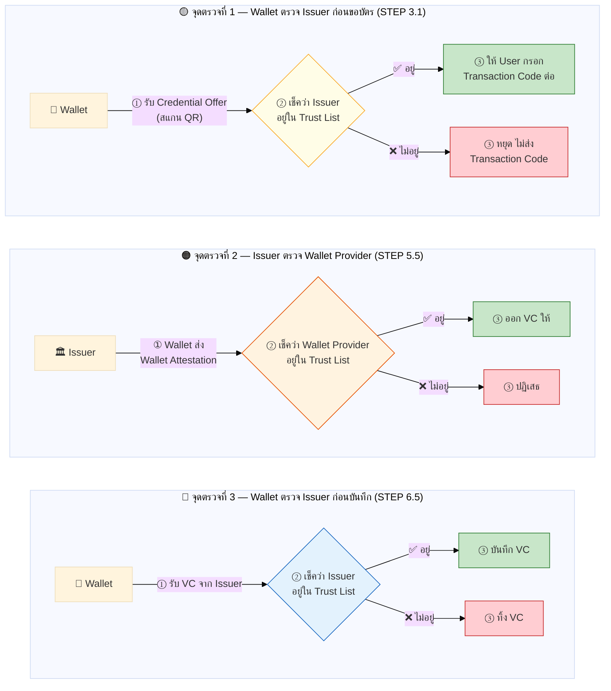
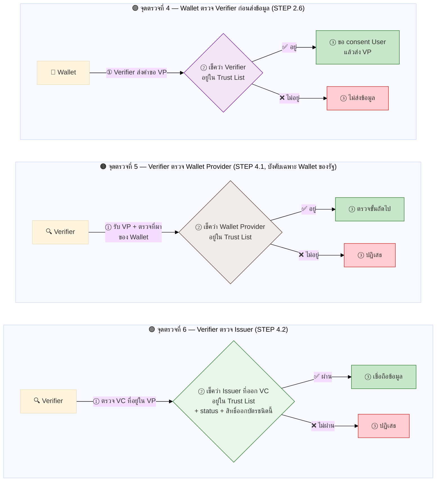
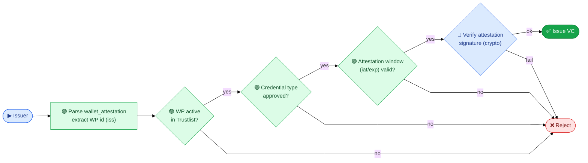
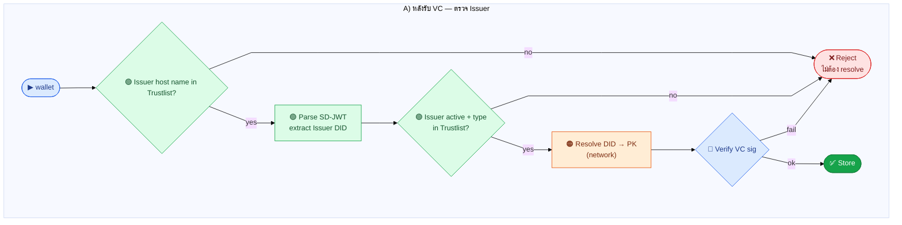
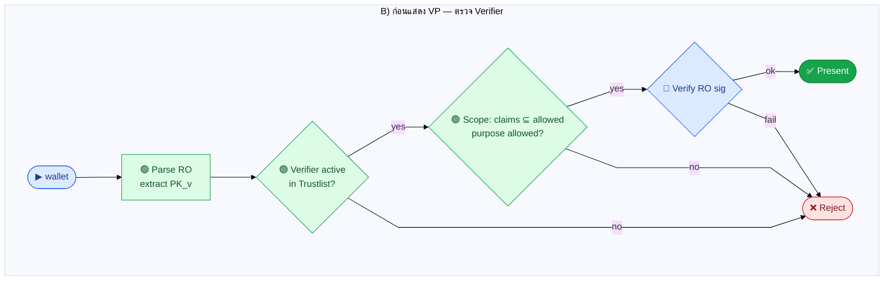
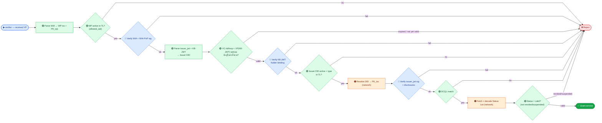

# ภาคผนวก ก — Trust List ถูกใช้ที่ไหนบ้าง และหลักการตรวจสอบความปลอดภัยพื้นฐาน (Core Security Rules)

ภาคผนวกนี้รวม **แผนที่จุดตรวจ Trust List ทั้งหมด** และ **ลำดับการตรวจสอบความปลอดภัยพื้นฐาน (Core Security Rules)** ที่ทุก flow ในคู่มือใช้ร่วมกัน แยกมาไว้ท้ายเล่มเพื่อให้ใช้เป็นแผ่นสรุป (cheat sheet) ที่เปิดดูได้เร็ว โดยไม่ต้องไล่อ่านทีละบท

เนื้อหาส่วนนี้เคยอยู่ในเนื้อบทหลัก ก่อนถูกย้ายมารวมไว้เป็นภาคผนวก ดูรายละเอียดของแต่ละจุดในบริบทจริงได้ที่ [บทที่ 3 การออกเอกสาร (OID4VCI)](../03-issuance-flow/01-minimal-flow.md) และ [บทที่ 4 การแสดงเอกสาร (OID4VP)](../04-presentation-flow/01-overview/index.md)

## ก.1 ภาพรวม — Trust List ถูกใช้ทุกครั้งที่ต้องตัดสินใจเรื่อง trust (จุดตรวจที่ 1–6)

แต่ละ Entity นำ Trust List ที่ cache ไว้ ไปใช้ตรวจสอบคู่สื่อสาร — แบ่งเป็น 2 flow รวม **จุดตรวจที่ 1–6** เรียงตามลำดับเวลา (เลขในวงเล็บคือ step ใน flow เต็มของ [บทที่ 3](../03-issuance-flow/02-full-flow/02b-full-flow-technical-detail.md) และ [บทที่ 4](../04-presentation-flow/02-full-flow/02b-full-flow-technical-detail.md))

**Flow ออก VC (OID4VCI) — จุดตรวจที่ 1–3:**

**Flow แสดง VP (OID4VP) — จุดตรวจที่ 4–6:**

**สรุป: Trust List ถูกใช้ทุกครั้งที่ Entity ต้องตัดสินใจเรื่อง trust**

| จุดตรวจที่ | Flow | Step ใน flow เต็ม | ใครเช็ค | เช็คอะไร | ถ้าไม่ผ่าน |
|:---------:|------|:-----------------:|---------|---------|-----------|
| **1** | ออก VC | 3.1 (บทที่ 3) | Wallet | Issuer ใน Credential Offer อยู่ใน Trust List? | หยุด ไม่ส่ง Transaction Code |
| **2** | ออก VC | 5.5 (บทที่ 3) | Issuer | Wallet Provider อยู่ใน Trust List? | ไม่ออก VC |
| **3** | ออก VC | 6.5 (บทที่ 3) | Wallet | Issuer อยู่ใน Trust List? | ทิ้ง VC ไม่บันทึก |
| **4** | แสดง VP | 2.6 (บทที่ 4) | Wallet | Verifier อยู่ใน Trust List? | ไม่ส่งข้อมูลให้ (จุดที่สำคัญที่สุดฝั่ง Wallet) |
| **5** | แสดง VP | 4.1 (บทที่ 4) | Verifier | Wallet Provider อยู่ใน Trust List? (บังคับเฉพาะ Wallet ของรัฐ) | ปฏิเสธ |
| **6** | แสดง VP | 4.2 (บทที่ 4) | Verifier | Issuer ของ VC อยู่ใน Trust List + status + สิทธิ์ออกบัตร? | ไม่เชื่อถือข้อมูล |

## ก.2 Core Security Rules — ลำดับการตรวจโดยละเอียดของแต่ละฝ่าย

ตารางนี้แบ่งประเภทของการตรวจแต่ละขั้นด้วยสี เพื่อให้เห็นว่าขั้นไหนเป็นแค่การเทียบข้อมูลในเครื่อง (ถูก/เร็ว) และขั้นไหนต้องเรียกออกไปนอกเครื่อง (ช้า/มีค่าใช้จ่าย)

| สี | ประเภทเช็ค | ตัวอย่าง |
|------|-----------|---------|
| 🟢 | parse field, lookup ใน Trustlist local cache, เทียบ status/scope/เวลา | WP/Issuer/Verifier active?, type อนุญาต?, iat/exp |
| 🔵 | verify signature (crypto) | RO sig, WIA sig, KB-JWT, VC sig |
| 🟠 | network call | Resolve DID → PK, Fetch Status List |

> **หลักสำคัญ:** ถ้าขั้น 🟢 (lookup Trustlist) ไม่ผ่าน ให้ **ปฏิเสธทันที ไม่ต้องเรียก network (🟠) ต่อ** เพื่อไม่ให้เปลืองทรัพยากรและไม่เสี่ยงถูกหลอกให้ยิงคำขอไปยังปลายทางที่ไม่น่าเชื่อถือ

### ก.2.1 Issuer — ตรวจก่อนออก VC

1. 🟢 Parse `wallet_attestation` → ดึง WP id (iss)
2. 🟢 Lookup: WP อยู่ใน Trustlist และ status = active?
3. 🟢 Credential type ที่จะออก อยู่ในที่อนุมัติไว้?
4. 🟢 สถานะ/ช่วงเวลา attestation (iat/exp) ยังใช้ได้?
5. 🔵 Verify `wallet_attestation` signature

### ก.2.2 Wallet / Holder — 2 บริบท

**A) หลังรับ VC — ตรวจ Issuer**

1. 🟢 Lookup Issuer host name ใน `issuer_entries`?
2. 🟢 Parse SD-JWT → ดึง Issuer DID
3. 🟢 Lookup: Issuer active + credential type อนุญาต ใน `issuer_entries`?
4. 🟠 Resolve DID → PK (network)
5. 🔵 Verify VC signature

**B) ก่อนแสดง VP — ตรวจ Verifier**

1. 🟢 Parse Request Object → ดึง PK_v
2. 🟢 Lookup: Verifier active ใน `verifier_entries`?
3. 🟢 Scope: claims ที่ขอ ⊆ allowed_attributes, purpose ∈ allowed_purposes?
4. 🔵 Verify RO signature + aud/exp/nonce

### ก.2.3 Verifier — ตรวจ VP

1. 🟢 Parse WIA → WP iss + PK_wp
2. 🟢 Lookup L3: WP active ใน Trustlist?
3. 🔵 Verify WIA + WIA-PoP signature
4. 🟢 Parse issuer_jwt
5. 🟢 **Check temporal: VC `nbf ≤ now ≤ exp` + VP(KB-JWT) `iat` ใหม่ / `exp` ยังไม่หมด** — ถ้าหมดอายุ/ยังไม่ถึงกำหนด → **ปฏิเสธ**
6. 🔵 Verify KB-JWT (holder binding)
7. 🟢 Lookup L4: Issuer DID active + credential type อนุญาต?
8. 🟠 Resolve DID → PK_iss
9. 🔵 Verify issuer_jwt signature + disclosures
10. 🟢 DCQL match
11. 🟠 Fetch + decode Status List
12. 🟢 Credential status = valid? (ไม่ revoked / suspended) — ถ้าไม่ valid → **ปฏิเสธ**

## ก.3 หลักการนี้ถูกใช้จริงที่ไหน

| Flow | จุดที่ใช้หลักการนี้ | อ่านรายละเอียดที่ |
|------|---------------------|--------------------|
| การออกเอกสาร (OID4VCI) | Issuer ตรวจ Wallet Provider ก่อนออกบัตร | [3.2.5 การตรวจสอบ Trustlist](../03-issuance-flow/02-full-flow/06-verification-details.md) |
| การแสดงเอกสาร (OID4VP) | Wallet ตรวจ Verifier + Verifier ตรวจ Wallet Provider/Issuer | [4.1 ภาพรวมการแสดงเอกสาร](../04-presentation-flow/01-overview/index.md) |
| ภาพรวม "ใครตรวจใคร" | ตารางสรุปทุกฝ่าย | [1.4 หลักการตรวจสอบ](../01-concepts-and-roles/03-common-verification-pattern.md) |
